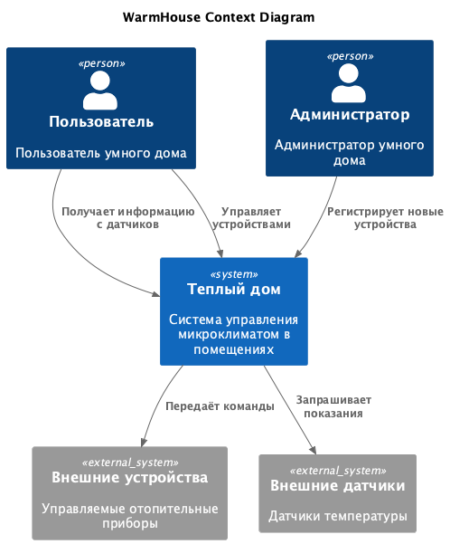
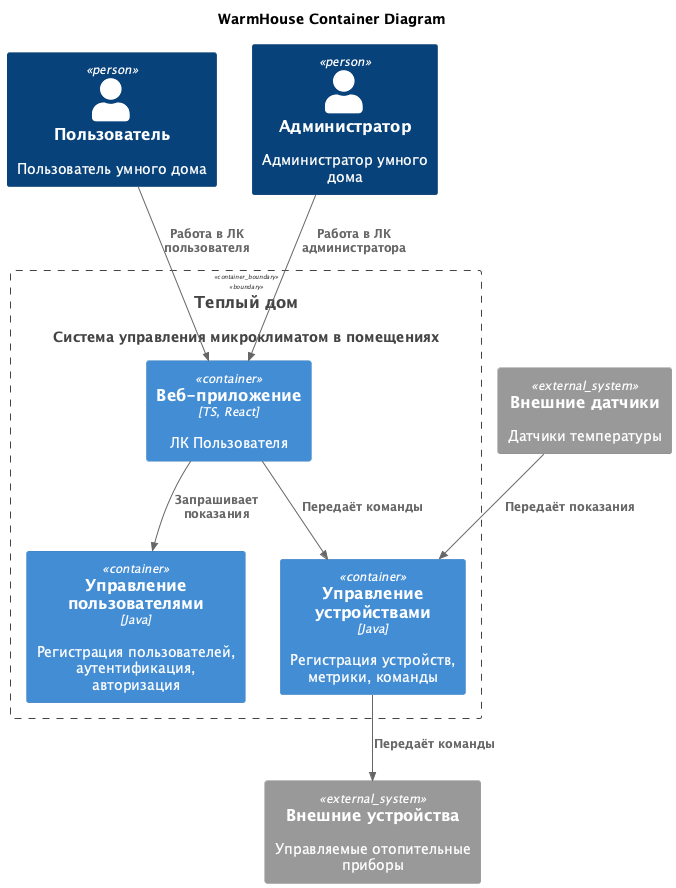
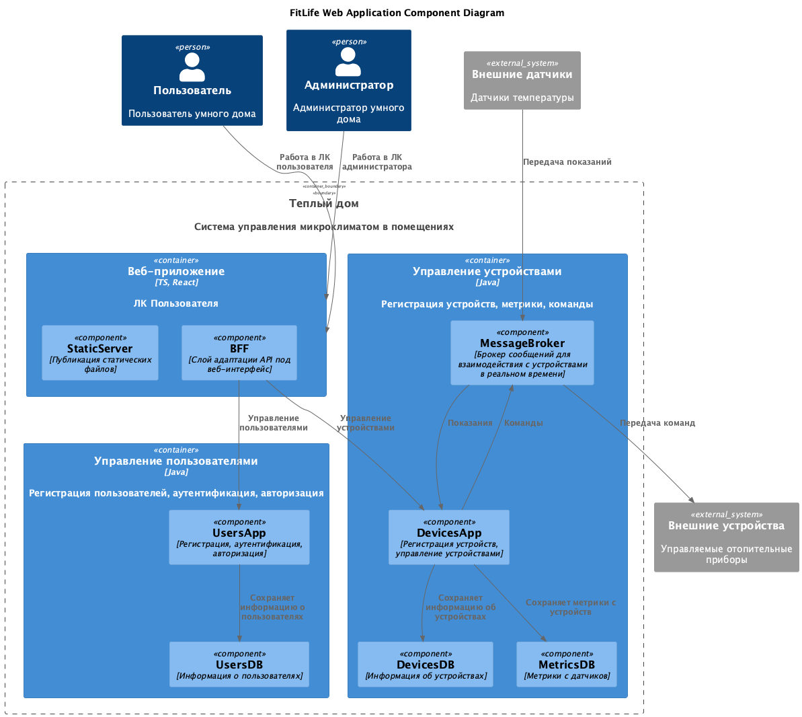

# Project_template

# Задание 1. Анализ и планирование

### 1. Описание функциональности монолитного приложения

**Управление отоплением:**

- Пользователи могут управлять подключенными к системе устройствами для отопления дома
- Система поддерживает ограниченный набор устройств.
- Каждая установка сопровождается выездом специалиста по подключению системы отопления в доме к текущей версии системы

**Мониторинг температуры:**

- Пользователи могут проверять температуру
- Каждая установка сопровождается выездом специалиста по подключению системы отопления в доме к текущей версии системы
- Самостоятельно подключить свой датчик к системе пользователь не может

### 2. Анализ архитектуры монолитного приложения

- Язык разработки: Java
- СУБД: PostgreSQL
- Интерфейсы: Синхронные взаимодействия

- Требования к сети пользователя:
  - WiFi
  - Статический внешний IP-адрес

### 3. Определение доменов и границы контекстов

#### Управление пользователями

- Регистрация пользователей
- ЛК пользователя

#### Управление устройствами

- Добавление устройств
- Приём метрик от датчиков
- Приём команд от веб-приложения, доставка до устройств

### **4. Проблемы монолитного решения**

- Не позволяет гибко добавлять новую функциональность в панель управления устройствами
- С ростом числа подключенных устройств неизбежно возникнут проблемы со снятием показаний с датчиков и доставки команд до устройств
- Неравномерный рост базы данных и сложности её масштабирования
- Необходимость настройки подключения сервера к датчику на территории пользователя потребует масштабирования команды выездных специалистов

### 5. Визуализация контекста системы — диаграмма С4



# Задание 2. Проектирование микросервисной архитектуры

В этом задании вам нужно предоставить только диаграммы в модели C4. Мы не просим вас отдельно описывать получившиеся микросервисы и то, как вы определили взаимодействия между компонентами To-Be системы. Если вы правильно подготовите диаграммы C4, они и так это покажут.

### Диаграмма контейнеров (Containers)



### Диаграмма компонентов (Components)



### Диаграмма кода (Code)

```markdown
C4 — Уровень кода (Code). Для самых критичных частей системы можете создать диаграммы на уровне кода
```

Видимо, могу и не создавать.

# Задание 3. Разработка ER-диаграммы

Добавьте сюда ER-диаграмму. Она должна отражать ключевые сущности системы, их атрибуты и тип связей между ними.

Четвёртое задание — дополнительное. Его можно сделать по желанию. Чтобы ревьюер быстрее проверил ваше решение, укажите, сделали вы это задание или нет. Для этого оставьте нужный эмодзи около заголовка задания:

✅ — вы выполнили задание.

❌ — вы пропустили задание.

# ✅ ❌ Задание 4. Создание и документирование API

### 1. Тип API

Укажите, какой тип API вы будете использовать для взаимодействия микросервисов. Объясните своё решение.

### 2. Документация API

Здесь приложите ссылки на документацию API для микросервисов, которые вы спроектировали в первой части проектной работы. Для документирования используйте Swagger/OpenAPI или AsyncAPI.
