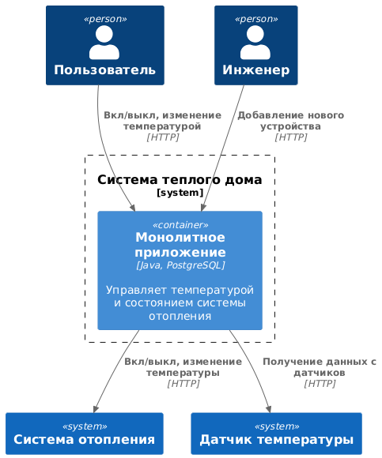
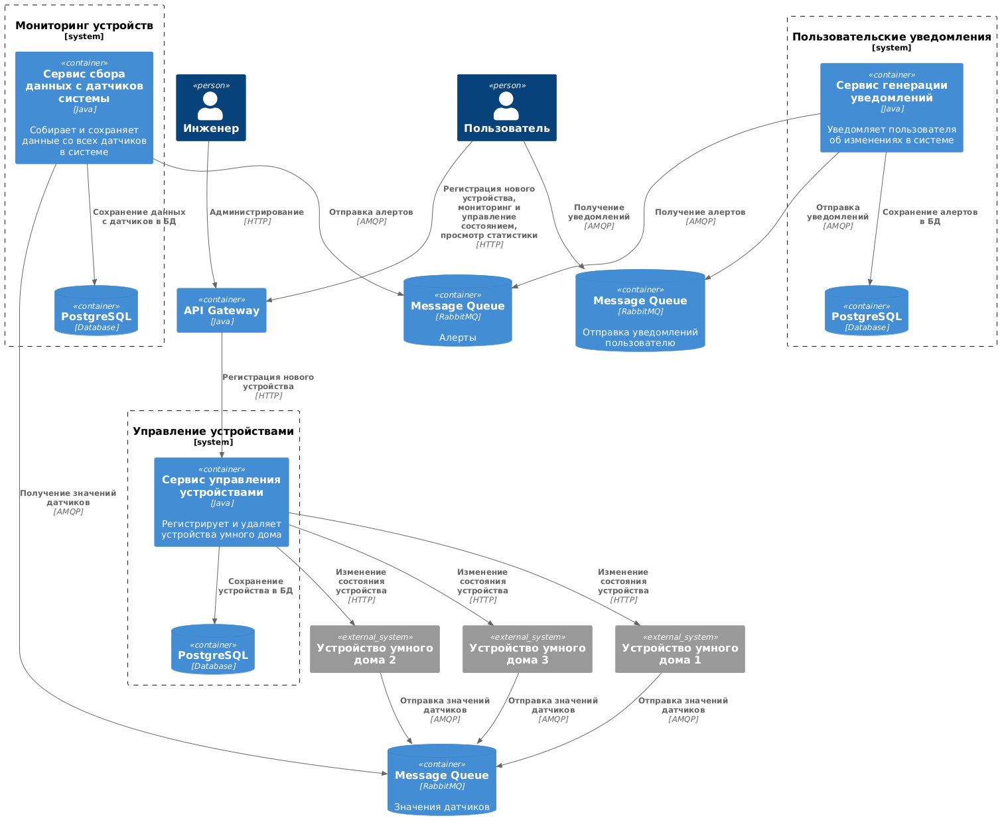
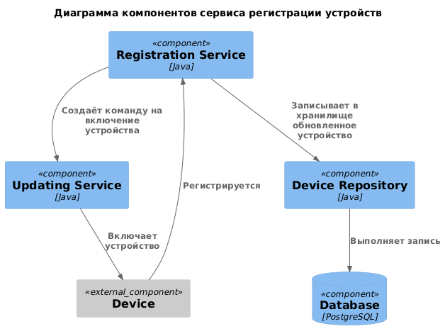
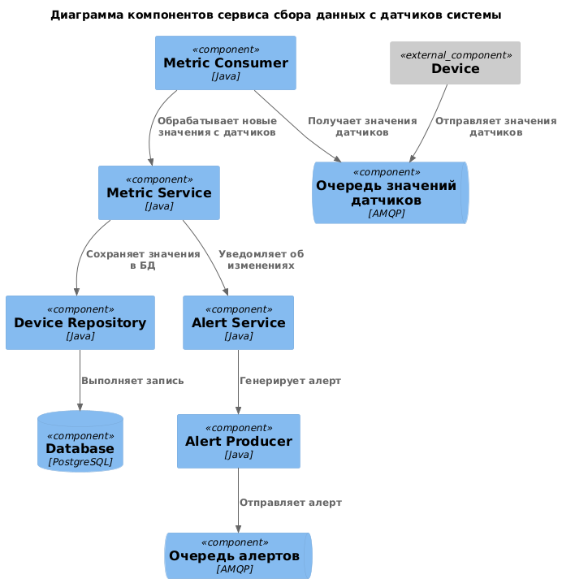
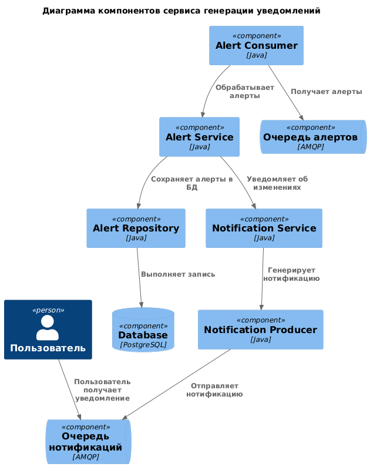
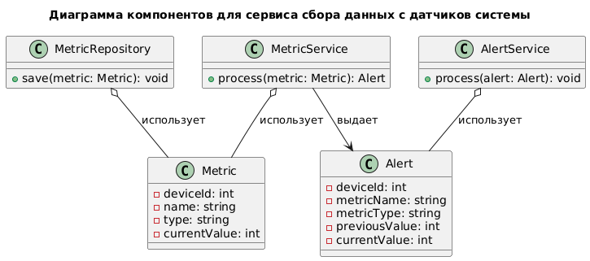
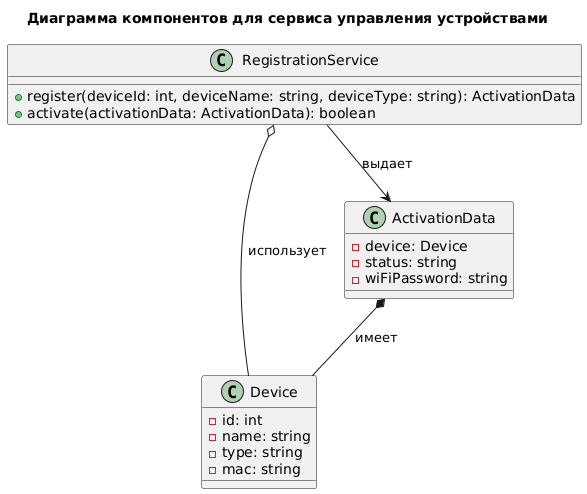
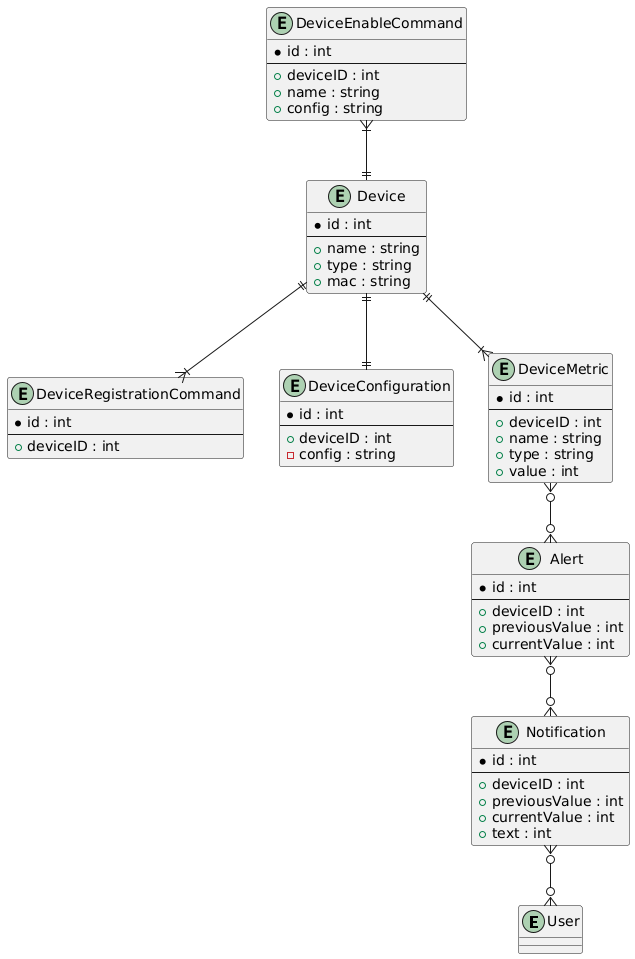

Это шаблон для решения **первой части** проектной работы. Структура этого файла повторяет структуру заданий. Заполняйте его по мере работы над решением.

# Задание 1. Анализ и планирование

Чтобы составить документ с описанием текущей архитектуры приложения, можно часть информации взять из описания компании условия задания. Это нормально.

### 1. Описание функциональности монолитного приложения

**Управление отоплением:**

- Пользователи могут включить или выключить отопление
- Пользователи могут установить новое значение температуры
- Система поддерживает управление от сервера к датчикам

**Мониторинг температуры:**

- Пользователи могут получить текущую температуру 
- Система поддерживает опрос датчиков сервером для получения текущей температуры
- Система поддерживает добавление новых датчиков с помощью сервисного инженера

### 2. Анализ архитектуры монолитного приложения

Перечислите здесь основные особенности текущего приложения: какой язык программирования используется, какая база данных, как организовано взаимодействие между компонентами и так далее.

- **Язык программирования:** Java 17
- **База данных:** PostgreSQL
- **Взаимодействие:** RESTful API для управления состоянием системы отопления: входящий запрос содержит идентификатор обновляемой сущности; обновляемая сущность загружается из БД через репозиторий Spring'а; происходит обновление свойства и запись обновленного состояния назад в БД

### 3. Определение доменов и границы контекстов

Домены, которые я выделил:

- Управление устройствами умного дома
- Сбор данных с датчиков
- Пользовательские уведомления

### **4. Проблемы монолитного решения**

- **Деплой**: требуется полная остановка сервиса для обновления
- **Масштабирование**: cистема не готова к увеличению нагрузки
- **Отказоустойчивость**: отсутствует

### 5. Визуализация контекста системы — диаграмма С4

Диаграмма в репозитории - c4_as_is.puml

# Задание 2. Проектирование микросервисной архитектуры

**Диаграмма контейнеров (Containers)**

Диаграмма в репозитории - c4_to_be.puml

**Диаграмма компонентов (Components)**

Сервис управления устройствами. 
Диаграмма в репозитории - c4_component_1.puml

Сервис сборка данных с датчиков системы
Диаграмма в репозитории - c4_component_2.puml

Сервис управления уведомлениями
Диаграмма в репозитории - c4_component_3.puml

**Диаграмма кода (Code)**

Диаграмма в репозитории - c4_code_1.puml

Диаграмма в репозитории - c4_code_2.puml

# Задание 3. Разработка ER-диаграммы

Диаграмма в репозитории - c4_er.puml

