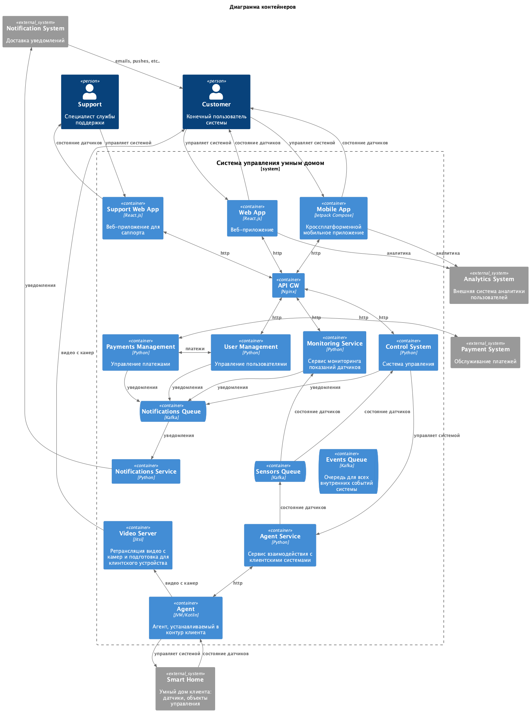
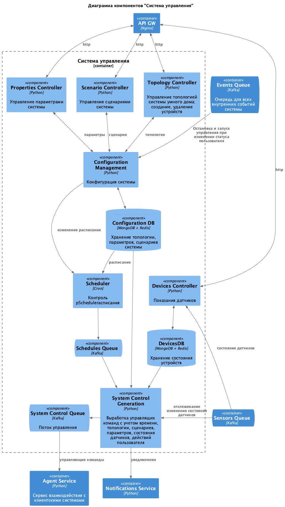
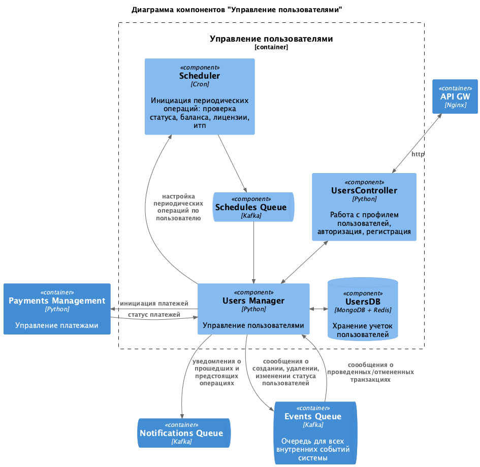
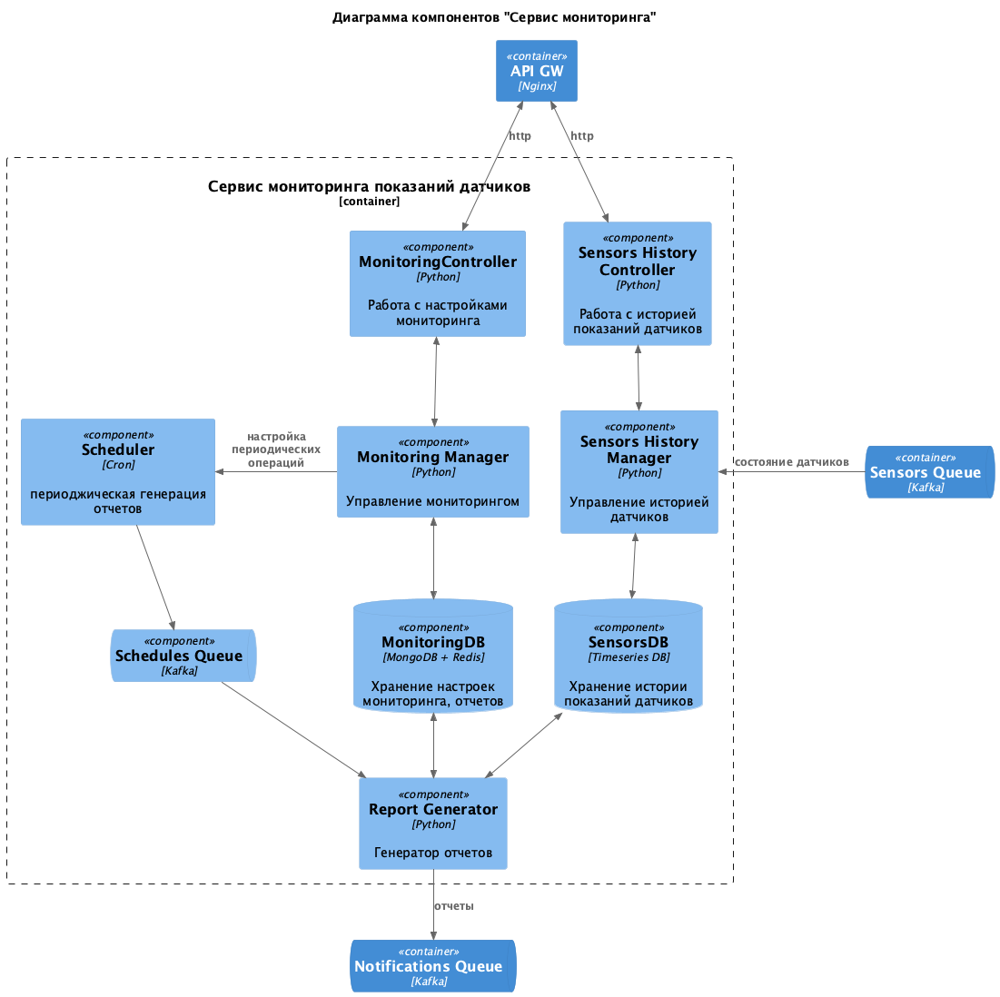
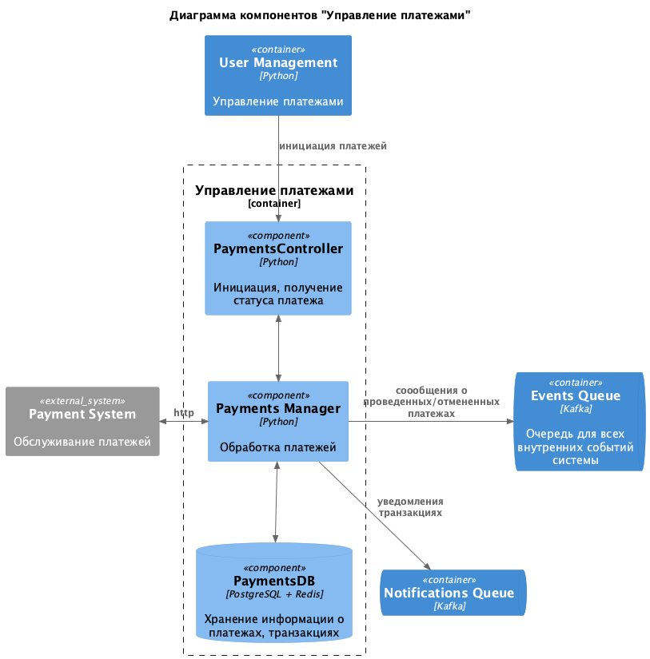
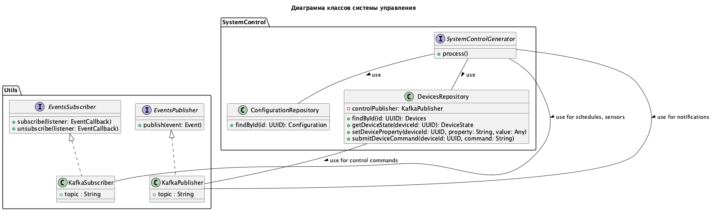
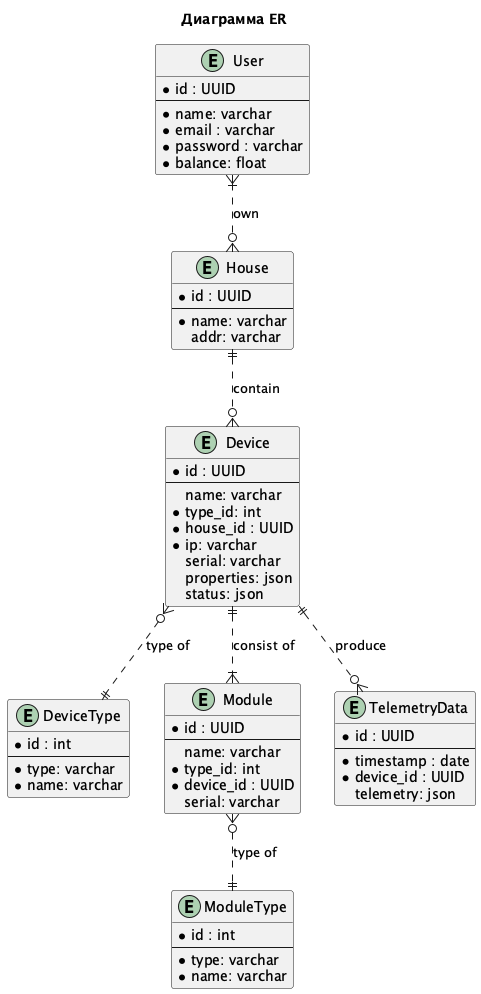

Это шаблон для решения **первой части** проектной работы. Структура этого файла повторяет структуру заданий. Заполняйте его по мере работы над решением.

# Задание 1. Анализ и планирование

Чтобы составить документ с описанием текущей архитектуры приложения, можно часть информации взять из описания компании условия задания. Это нормально.

### 1. Описание функциональности монолитного приложения

В текущей реализации Система отопления = 1 объект управления.
Пользовательские механизмы конфигурирования структуры и состава системы отопления не реализованы.
Также на данный момент системы отопления не связаны с пользователями.

**Управление отоплением:**

- Пользователи через API по id системы могут:
  - включать и выключать систему отопления
  - устанавливать целевую температуру системы отопления
  - выполнять 2 предыдущих действия за 1 запрос

**Мониторинг температуры:**

- Пользователи через API по id системы могут:
  - получать текущую температуру системы отопления
  - получать текущее состояние системы отопления (вкл/выкл, текущая температура, целевая температура)

### 2. Анализ архитектуры монолитного приложения

* Язык программирования: Java
* База данных: PostgreSQL, при помощи JDBC-коннектора
* Архитектура: Монолитная, все компоненты системы (обработка запросов, бизнес-логика, работа с данными) находятся в рамках одного приложения.
* Взаимодействие: Синхронное, запросы обрабатываются последовательно, на основе REST
* Масштабируемость: Ограничена, так как монолит сложно масштабировать по частям.
* Развёртывание: Требует остановки всего приложения.

Проект организован в соответствии со стандартной структурой Maven/Gradle проекта:

- **Основной класс приложения** аннотирован `@SpringBootApplication`.
- **Пакеты**:
    - `controller` - контроллеры для обработки HTTP-запросов.
    - `service` - сервисы для бизнес-логики.
    - `repository` - репозитории для доступа к базе данных.
    - `entity` - сущности JPA.
    - `dto` - объекты передачи данных (DTO).

### 3. Определение доменов и границы контекстов

Домены:

**Управление состоянием системы отопления:**

Изменение параметров работы системы отопления и сохранение их в БД.
Состояние системы отоплоения включает в себя: 
- вкл/выкл
- целевая температура
- текущая температура

**Мониторинг состояния датчиков:**

Получение состояния датчиков
Состояние датчиков включает в себя:
- текущая температура
- время последнего показания

### **4. Проблемы монолитного решения**

- Высокая связность кода. 
- Невозможность масштабирования и развертывания приложения по частям, что противоречит SaaS.
- По мере разрастания проекта будет становиться труднее его поддерживать.
- По мере разрастания проекта становится проблематичным использовать новые технологии.
- По мере разрастания проекта становится проблематичным поддерживать экспертизу в команде .

Текущее монолитное решение не вызывает проблем при текущем варианте использования (мало пользователей, слабый функционал), но поскольку перед компание поставлены амбициозные цели (SaaS, экспансия), проблемы монолитного подхода встанут в полный рост.

### 5. Визуализация контекста системы — диаграмма С4

**Диаграмма контекста as-is (Context)**

**Диаграмма контекста to-be (Context)**

# Задание 2. Проектирование микросервисной архитектуры

**Диаграмма контейнеров (Containers)**

**Диаграмма компонентов (Components)**

**Диаграмма кода (Code)**

# Задание 3. Разработка ER-диаграммы

**ER-диаграмма**

