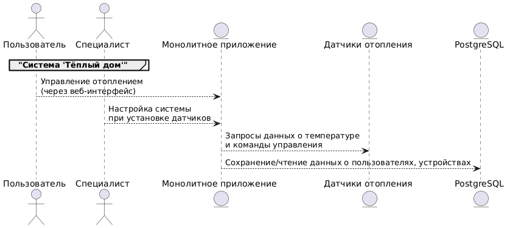
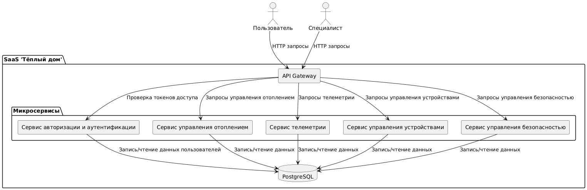
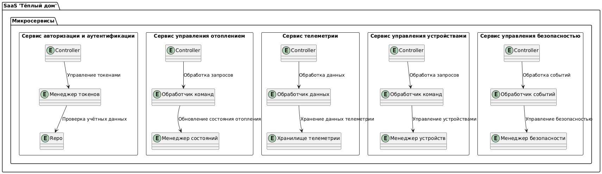
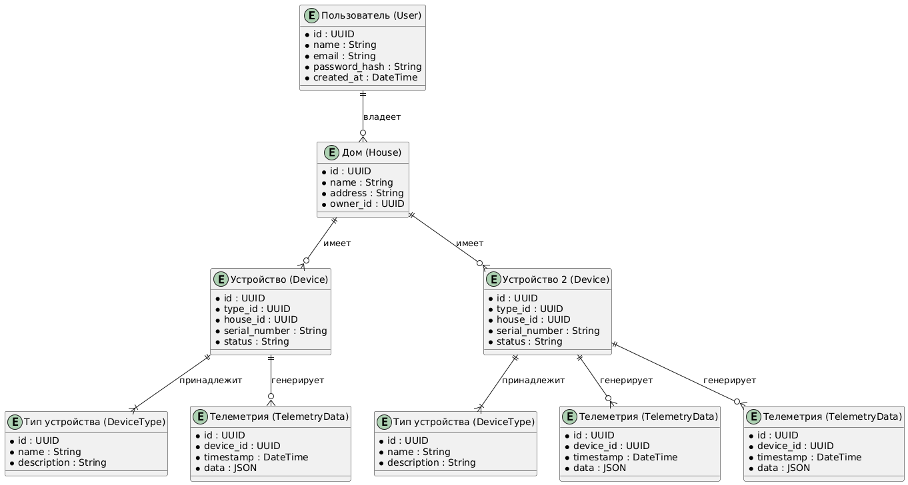

Это шаблон для решения **первой части** проектной работы. Структура этого файла повторяет структуру заданий. Заполняйте его по мере работы над решением.

# Задание 1. Анализ и планирование

Чтобы составить документ с описанием текущей архитектуры приложения, можно часть информации взять из описания компании условия задания. Это нормально.

### 1. Описание функциональности монолитного приложения

**Управление отоплением:**

- Пользователи могут удалённо включать/выключать отопление в своих домах.
- Система поддерживает установку определенной температуры

**Мониторинг температуры:**

- Пользователи могут просматривать текущую температуру в своих домах через веб-интерфейс.
- Система получает данные о температуре с датчиков, установленных в домах. 

### 2. Анализ архитектуры монолитного приложения

    Язык программирования: Java
    База данных: PostgreSQL
    Архитектура: Монолитная, все компоненты системы (обработка запросов, бизнес-логика, работа с данными) находятся в рамках одного приложения.
    Взаимодействие: Синхронное, запросы обрабатываются последовательно.
    Масштабируемость: Ограничена, так как монолит сложно масштабировать по частям.
    Развёртывание: Требует остановки всего приложения.

### 3. Определение доменов и границы контекстов

Управление устройствами
границы контекста: включение/выключение новых устройств, получение статусов.

Управление отоплением
границы контекста: получение текущей температуры, установка новых значений.

### **4. Проблемы монолитного решения**

- Сложно масштабировать, приходится увеличивать ресурсы для всего кода
- Синхронное взаимодействие может стать узким местом при увеличении числа устройств
- Трудности с выпуском новых фич, нужно останавливать и обновлять весь код приложения
- Проблемы с масштабируемостью и поддержкой собственного сервера, низкая отказоустойчивость

### 5. Визуализация контекста системы — диаграмма С4

# Задание 2. Проектирование микросервисной архитектуры

В этом задании вам нужно предоставить только диаграммы в модели C4. Мы не просим вас отдельно описывать получившиеся микросервисы и то, как вы определили взаимодействия между компонентами To-Be системы. Если вы правильно подготовите диаграммы C4, они и так это покажут.

**Диаграмма контейнеров (Containers)**

**Диаграмма компонентов (Components)**

**Диаграмма кода (Code)**

# Задание 3. Разработка ER-диаграммы

