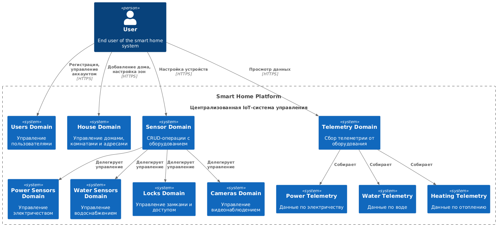
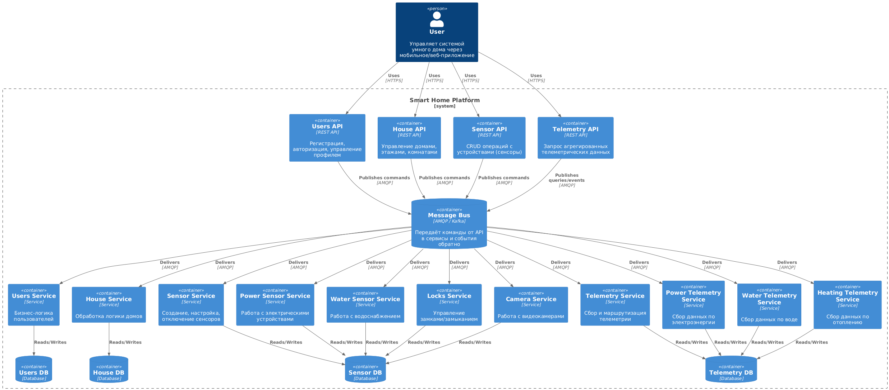
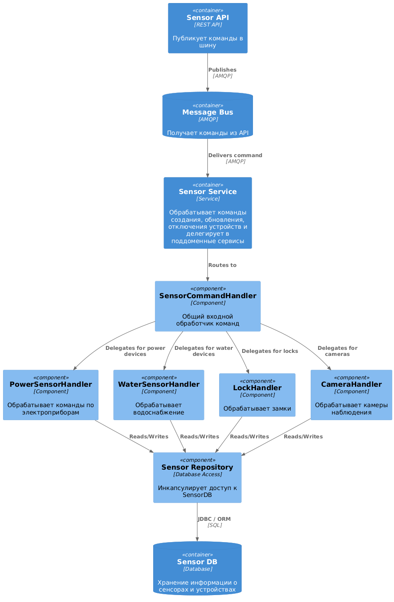
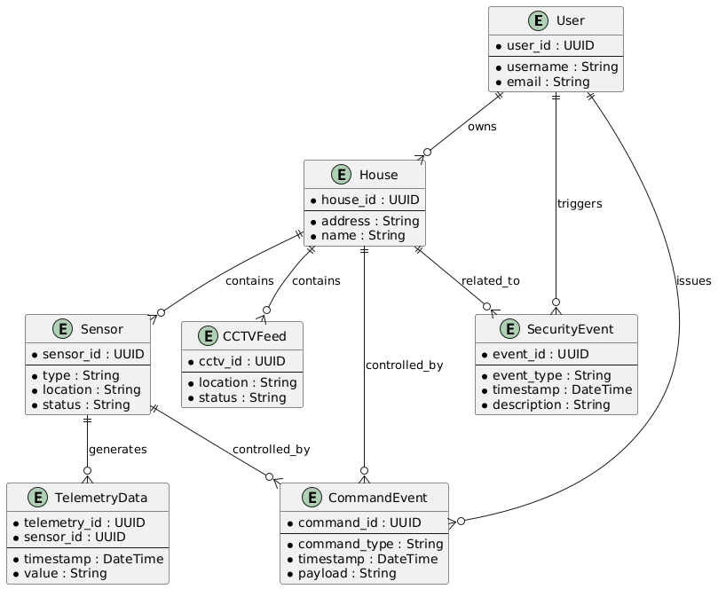

# Project_template

Это шаблон для решения проектной работы. Структура этого файла повторяет структуру заданий. Заполняйте его по мере работы над решением.

# Задание 1. Анализ и планирование

Чтобы составить документ с описанием текущей архитектуры приложения, можно часть информации взять из описания компании и условия задания. Это нормально.

### 1. Описание функциональности монолитного приложения

**Управление отоплением:**

- Пользователи могут удалённо включать/выключать отопление в своих домах.
- Система поддерживае синхронное взаимодействие. 
- Новые датчики можно подключить к системе только при вызове специалиста.

**Мониторинг температуры:**

- Пользователи могут посмотреть данные с датчика температуры 
- Система поддерживает дистанционное управление термостатом

### 2. Анализ архитектуры монолитного приложения

* Архитектура монолит 
* Система написана на языке Go 
* СУБД Postgres
* Синхронное API
* Управление только датчиками температуры

### 3. Определение доменов и границы контекстов

* домен домовладений (House domain)
* домен пользователей (Users domain)
* домен управления оборудованием (Sensor domain) CRUD операции с сенсорами, этот и следующий домен можно раздробить на домены конкретных зон: электричество, водоснабжение, замки, камеры и тд тем самым уменьшив зону ответственности домена и в случае неполадок будет проще выявить проблемную зону и уменьшит нагрузку на целевую БД, также упростит масштабирование при возрастании нагрузки на ккакомто одном участке обслуживания.
* домен данных с сенсоров (Telemetry domain) точно также сервис телеметрии под конкретные зоны свет, вода, отопление.


### **4. Проблемы монолитного решения**

- для добавления нового функционала(например, управление освещением) потребуется серьезное вмешательство в сконтекст БД, потребуются новые методы API зачастую в контексте одного и тогоже функционала что размывает границы между зонами ответственности сервисов.
- прямое управление от сервера к датчикам, в случае потери соединения с контроллером отопления  команда на изменеие параметра не будет доставлена к целевому датчику.
- отсутсвие гибкости в подключении нового оборудования + затраты на вызов установщика.
* отсутсвие возможности масштабироваться горизонтально, и если масштабировать, то весь проект целиком, а не узкие места, например, взаимодействие БД и приложения.

### 5. Визуализация контекста системы — диаграмма С4



# Задание 2. Проектирование микросервисной архитектуры


**Диаграмма контейнеров (Containers)**



**Диаграмма компонентов (Components)**

Описание для компонента датчиков



**Диаграмма кода (Code)**

Добавьте одну диаграмму или несколько.

# Задание 3. Разработка ER-диаграммы




# Задание 4. Создание и документирование API

### 1. Тип API

Укажите, какой тип API вы будете использовать для взаимодействия микросервисов. Объясните своё решение.

### 2. Документация API

Здесь приложите ссылки на документацию API для микросервисов, которые вы спроектировали в первой части проектной работы. Для документирования используйте Swagger/OpenAPI или AsyncAPI.

# Задание 5. Работа с docker и docker-compose

Перейдите в apps.

Там находится приложение-монолит для работы с датчиками температуры. В README.md описано как запустить решение.

Вам нужно:

1) сделать простое приложение temperature-api на любом удобном для вас языке программирования, которое при запросе /temperature?location= будет отдавать рандомное значение температуры.

Locations - название комнаты, sensorId - идентификатор названия комнаты

```
	// If no location is provided, use a default based on sensor ID
	if location == "" {
		switch sensorID {
		case "1":
			location = "Living Room"
		case "2":
			location = "Bedroom"
		case "3":
			location = "Kitchen"
		default:
			location = "Unknown"
		}
	}

	// If no sensor ID is provided, generate one based on location
	if sensorID == "" {
		switch location {
		case "Living Room":
			sensorID = "1"
		case "Bedroom":
			sensorID = "2"
		case "Kitchen":
			sensorID = "3"
		default:
			sensorID = "0"
		}
	}
```

2) Приложение следует упаковать в Docker и добавить в docker-compose. Порт по умолчанию должен быть 8081

3) Кроме того для smart_home приложения требуется база данных - добавьте в docker-compose файл настройки для запуска postgres с указанием скрипта инициализации ./smart_home/init.sql

Для проверки можно использовать Postman коллекцию smarthome-api.postman_collection.json и вызвать:

- Create Sensor
- Get All Sensors

Должно при каждом вызове отображаться разное значение температуры

Ревьюер будет проверять точно так же.


