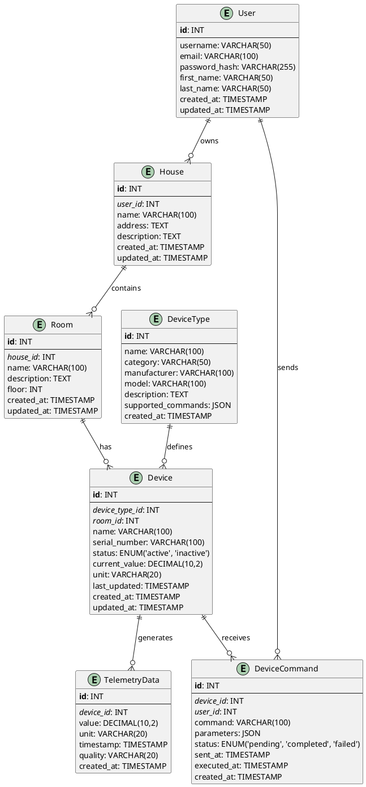

# Project_template

Это шаблон для решения проектной работы. Структура этого файла повторяет структуру заданий. Заполняйте его по мере работы над решением.

# Задание 1. Анализ и планирование


Чтобы составить документ с описанием текущей архитектуры приложения, можно часть информации взять из описания компании и условия задания. Это нормально.

### 1. Описание функциональности монолитного приложения

**Управление отоплением:**

- Пользователи могут создавать, просматривать, обновлять и удалять датчики температуры в системе умного дома
- Система поддерживает мониторинг температуры в различных локациях (комнатах) дома
- Пользователи могут получать актуальные данные о температуре по конкретной локации через внешний API температурного сервиса
- Система автоматически обновляет показания температурных датчиков в реальном времени при запросах данных

**Мониторинг температуры:**

- Пользователи могут просматривать список всех датчиков с их текущими показаниями, статусом и местоположением
- Система поддерживает получение детальной информации о конкретном датчике по его ID
- Пользователи могут вручную обновлять значения и статус датчиков
- Система интегрируется с внешним API для получения актуальных данных о температуре
- Поддерживается отслеживание времени последнего обновления данных каждого датчика
-
### 2. Анализ архитектуры монолитного приложения

Приложение разработано на языке программирования **Go** и представляет собой монолитный веб-сервис

**Технологический стек:**

- **Язык программирования**: Go 1.22
- **Веб-фреймворк**: Gin
- **База данных**: PostgreSQL 16
- **Контейнеризация**: docker и docker-compose

**Архитектурная структура:** Слоистая архитектура с четким разделением на слои:

- **Слой обработчиков** (handlers/) - HTTP-обработчики запросов
- **Слой сервисов** (services/) - бизнес-логика и интеграция с внешними API
- **Слой моделей** (models/) - структуры данных
- **Слой базы данных** (db/) - работа с PostgreSQL

**Взаимодействие между компонентами:**

- HTTP-запросы обрабатываются через Gin роутер
- Обработчики вызывают методы слоя базы данных и сервисов
- Сервис температуры делает HTTP-запросы к внешнему API
- Все взаимодействие с БД происходит через connection pool
- Используется graceful shutdown для корректного завершения работы

### 3. Определение доменов и границы контекстов

#### **Домен Управление устройствами**

**Основная ответственность**: Управление жизненным циклом устройств умного дома

**Поддомены:**
- **Управление датчиками (Sensor Management)** - основной поддомен
  - Регистрация новых датчиков
  - Конфигурирование параметров датчиков
  - Обновление метаданных датчиков
  - Удаление датчиков из системы

- **Каталог устройств (Device Catalog)** - вспомогательный поддомен
  - Хранение типов устройств
  - Поддержка различных типов датчиков (temperature, humidity, etc.)
  - Управление единицами измерения

**Границы контекста:**
- **Контекст управления датчиками**: Включает модели `Sensor`, `SensorCreate`, `SensorUpdate` и операции CRUD
- **Контекст каталога устройств**: Включает типы устройств (`SensorType`), единицы измерения и конфигурации

#### **Домен Мониторинг и сбор данных**

**Основная ответственность**: Сбор, обработка и предоставление данных с устройств

**Поддомены:**
- **Сбор показаний (Data Collection)** - основной поддомен
  - Получение актуальных показаний с датчиков
  - Интеграция с внешними API источниками данных
  - Обновление значений датчиков в реальном времени

- **Управление состоянием (State Management)** - основной поддомен
  - Отслеживание статуса устройств (active/inactive)
  - Фиксация времени последнего обновления
  - Управление жизненным циклом показаний

**Границы контекста:**
- **Контекст сбора данных**: Включает `TemperatureService`, интеграцию с внешним API, обработку `TemperatureResponse`
- **Контекст состояния устройств**: Включает управление статусами, временными метками и валидацией данных

#### **Домен Пространственное управление**

**Основная ответственность**: Управление пространственной структурой умного дома

**Поддомены:**
- **Управление локациями (Location Management)** - основной поддомен
  - Определение комнат и зон в доме
  - Привязка устройств к локациям
  - Поиск устройств по местоположению

- **Пространственная аналитика (Spatial Analytics)** - вспомогательный поддомен
  - Получение данных по локациям
  - Агрегация показаний по комнатам
  - Пространственные запросы

**Границы контекста:**
- **Контекст локаций**: Включает управление местоположениями, привязку датчиков к комнатам
- **Контекст пространственных запросов**: Включает endpoint `/temperature/:location` и логику поиска по местоположению

#### **Взаимодействие между доменами:**

1. **Device Management → Monitoring**: Зарегистрированные датчики становятся источниками данных для мониторинга
2. **Location Management → Device Management**: Локации используются при создании и конфигурировании датчиков
3. **Monitoring → Location Management**: Данные с датчиков агрегируются по локациям для пространственной аналитики

### **4. Проблемы монолитного решения**

**Проблемы масштабируемости:**

- Невозможность независимого масштабирования компонентов (например, если нагрузка на API температуры высокая, приходится масштабировать всё приложение)
- Все компоненты используют одну базу данных, что может стать узким местом

**Проблемы развертывания:**

- Любое изменение требует пересборки и перезапуска всего приложения
- Высокий риск при развертывании - сбой в одном компоненте может привести к недоступности всей системы

**Проблемы разработки:**

- По мере роста команды разработчиков будут возникать конфликты при работе с общей кодовой базой
- Сложность тестирования - для тестирования одного компонента нужно поднимать всю систему

**Проблемы надежности:**

- Отказ внешнего температурного API может повлиять на работу всей системы
- Нет изоляции ошибок - проблема в одном модуле может повлиять на другие

**Технологические ограничения:**

- Все компоненты привязаны к одному технологическому стеку (Go)
- Сложность внедрения новых технологий для отдельных компонентов


### 5. Визуализация контекста системы — диаграмма С4

#### Существующая диаграмма контекста:
[Схема взаимодействия C4](https://img.plantuml.biz/plantuml/png/VLHTQnD157tVNp7cAOKs--9JdrfBiKhLsCGteMooIxkm7s5tWYqYf8bf2nMgFeeWuWzmgOs9-VmBT_wHvqusIVFH1iBCt3ltt3FdpEnMBAr8LdtFUEG6PQzgE-9OoagyQPgHzIvtvChZQgaQEr4v3AGJo5mvzCsAPmLSin5BstDBvixZZJo7thpODtqhbaw4qE4ELvp8N8NH3UbApn7qZOOqK7LgKLUTgRfGPzJX2G9zTILKW_eqm9u_D1HqYqcV4iF8Er4S1bdciIuoz0Fndlf4ROmtbEXgh3ES-qezIb292BNK-Mh4pDe4qh9zD-2wpyZrgOEjce-gQToXgcKUp2uS0C16uHGA-8TFmcfWMz5fDlQXy5xeEmpqSxQRall8YVU6m6yCDAlVhbG0KU2buBL0m7FBbdJ3GBFypkAoDcXIrxEMe178TX0QqbzqnG4uU0kzhhazPnE8s1ldna5mKbVKdp32F_SseD_KHhIxAPw6EEQ7wK5tJsGMOyM9B5cDdEtyCt0fpW82aTIQ0Iovr1p-iN0jDBzXGIQ4QAITRQYBAHra4an1I3K5L4gr6-bYc83DDMg1q1qsjYMjaXMpuFambaUHKtYzhoby0LWRmi-ZfceqjHQ3MMluhJwoosoBEiUw8yP6SUCBhBkODTdq0yTBh-U2NVHhfh6w1klwGZtVg_MnJKDeqjSvjWmtUxfzp1Nd1E9UiPWlc0UxXQ9MTattJk_nOlFbUzjHDJZSMdnwZNkHvo6NZ4uV8rkMqatmj64BHdwZclRS6HvmCULWFY-yUhco_HrdyPI64yicmdO4gmhmPULM6ZT_GTQCBIUm-Mlr7m00)

```plantuml
@startuml
!include https://raw.githubusercontent.com/plantuml-stdlib/C4-PlantUML/master/C4_Context.puml

title Контекст системы умного дома

Person(user, "Пользователь", "Владелец умного дома")
Person(admin, "Администратор", "Администратор системы")

System_Boundary(smartHome, "Система умного дома") {
    System(smartHomeApp, "Smart Home Application", "Монолитное приложение для управления умным домом.\nЯзык: Go")
}

System_Ext(temperatureAPI, "Temperature API", "Внешний сервис для получения данных о температуре")
System_Ext(database, "PostgreSQL", "База данных для хранения информации о датчиках")

Rel(user, smartHomeApp, "Управляет датчиками, просматривает данные", "HTTPS/REST API")
Rel(admin, smartHomeApp, "Администрирует систему", "HTTPS/REST API")
Rel(smartHomeApp, temperatureAPI, "Получает актуальные данные о температуре", "HTTP/JSON")
Rel(smartHomeApp, database, "Сохраняет и читает данные о датчиках", "PostgreSQL")
@enduml
```

# Задание 2. Проектирование микросервисной архитектуры

В этом задании вам нужно предоставить только диаграммы в модели C4. Мы не просим вас отдельно описывать получившиеся микросервисы и то, как вы определили взаимодействия между компонентами To-Be системы. Если вы правильно подготовите диаграммы C4, они и так это покажут.

[**Диаграмма контейнеров (Containers)**](https://img.plantuml.biz/plantuml/png/lLRRJXDH57tlLnnvgebb4iEJJq0XOiHOMeoFpMbxW8RfJ9cPWiIOS174G6paoIU9yGU6IyCWRVs5S_x8jSzS2eN1Q4J2PSxPUzPQ-rh6NOyxNgjXPXxKhQhPgWcsv7bDzubXE7njTB7kBRKgBLSuLTloXEMDLks6qJIvHU_aNAzcrYj6VYnNeAjNBsODHoounfBWDTTeSDSJ3gpbF5xcTKiueqsYodXrpnJiDNSQCpR0MNwCcM9LcEmnIrmpcO9mNDlA4liZDYAFP5zUgWDvZhydqbTRiaFd4R8ToalfopEwaHsrozIsxCeU74zbd-6-ZwC_yZ2JAQr3KwCyQRUi6dVMisu3uS_O3K4etsIWDZKklDCmsDiCmrUYCrlZxbB5vawjl40e9K9a1CccOWjfB0fUzLYfC149xiZZdFm1lG4UUseBwj9mAqEuaxowB2oD-jJMS9-1SWwn7RMP0oHf3W3kCndWc-11SgesaBPTd0DAnJMsgGhuF5xXBd4LRDTRT4HfRZP2zu7kKn9yaFJKljgXmwLgCxL3g4IDdm0NckwzxEEw6zEnC8EecVeG2bCxm_7EjKHBP5VeDpYVyuLbhic_ufKEm3hoJ1qmjOdWZY5W2pWNYGXTAYrBRLC9uT-N5xgO9n5HMFciU8EUjBWvqQmN77krNXFEIuiOfoC3coWyOx69mQPL76b4j9sye3PJ6marSVIrjQUpGDq2YD-opg_PgQom_JNhkwJ9WHtszvHOhLV5zN33TWejcZoEz52tqHvL4mb6lYdv9pGPJFuCwm1culTn3J7ga_eO-cvh1tqTjeFi9AMHNQRdKmUZgzY5sBkLXYcweJJEpdzLcYaAiroCbj7GoCll0pZLXeojeMu7SF0e50L1UYweHGFD4Rk7aoKx5DlC_7oXP1IdI_DHLKFswxn32mAEENa21BqWrNugpjGDd6JmiGBxyKJ7aGICmj1Pf3Db96g_TfGv7UoUFDOTYMTYTbTCojeDuIGr7dBv1LgxkW194ORGLHjvmyJhHNojMZSSYRNfs9vzIvYLFmxpQaMYzJLe2LfVWnXd-Jh8qXRBxQEVD5IKYzIrTByvkei_dBxxuuy4f4MUkhamz_Wm0a4NT5IL2mpJ9Ws-fcHu6ko5RZHrLvUedkZq8KjBHUg2-cU25ek5V2Hb79_lzA_IBm00)

```plantuml
@startuml
!include https://raw.githubusercontent.com/plantuml-stdlib/C4-PlantUML/refs/heads/master/C4_Container.puml

title WarmHouse C4 level 2 Container

Person(user, "Пользователь", "Владелец умного дома")

System_Boundary(smartHome, "Система умного дома") {
    Container(dashboard_fe, "Smart Home Dashboard", "React SPA", "Веб-клиент")
    Container(dashboard_be, "Smart Home Backend", "Go", "Бизнес-логика и интеграции")

    ContainerDb(database, "PostgreSQL", "База данных для хранения информации о датчиках")
    ContainerQueue(queue, "Kafka", "Очередь событий для умных устройств")
    System(externalApiProviderOne, "External API Provider One", "Провайдер для стороннего API")
    System(externalApiProviderTwo, "External API Provider Two", "Провайдер для стороннего API")
}

System_Ext(smartDeviceProviderOne, "Smart Device API One", "Внешний сервис предоставляющий управление умным девайсом")
System_Ext(smartDeviceProviderTwo, "Smart Device API Two", "Внешний сервис предоставляющий управление умным девайсом")

Rel_R(user, dashboard_fe, "Управляет датчиками, просматривает данные", "HTTPS/REST API")
Rel_R(dashboard_fe, dashboard_be, "API-вызовы", "HTTPS/REST API")
Rel_D(dashboard_fe, database, "Сохраняет и читает состояние дашборда", "sql")


Rel_R(dashboard_be, queue, "Изменение состояния, обновление состояния", "proto")
Rel_D(dashboard_be, database, "Сохраняет и читает данные о девайсах", "sql")

Lay_D(externalApiProviderOne, externalApiProviderTwo)

Rel_R(queue, externalApiProviderOne, "Изменение состояния, обновление состояния", "proto")
Rel_R(queue, externalApiProviderTwo, "Изменение состояния, обновление состояния", "proto")

Rel_R(externalApiProviderOne, smartDeviceProviderOne, "Взаимодейтсвие с внешним провайдером", "HTTPS/REST API")
Rel_R(externalApiProviderTwo, smartDeviceProviderTwo, "Взаимодейтсвие с внешним провайдером", "gRPC API")
@enduml
```

**Диаграмма компонентов (Components)**

Добавьте диаграмму для каждого из выделенных микросервисов.

### Smart Home Dashboard - Диаграмма компонентов

[Диаграмма компонетов UI](https://img.plantuml.biz/plantuml/png/dLGzRnD14EtzAnPNZeHp3HLLY8E8fKHO_X2bjRvRuXFtfRirIOIGx81e72aI5Ke11GMj4s6uACxbB-p-8zxS-kDmN21SdFPcPzvxC_FEEudaiHpuNkcH6zZUm16iBsMKFBMic1zl7xcoF-WD4X7ROI158BVjqBSYZmTKKqsauxazg_Qasg1Gv_30YiNhnEeBxYIMpnCfOjnsQw4VXG6LHqHLagxq16lve6RxeI_O7a_wlP373gioTQaoDLFtUDwfgRhJPtfSAjN0pzr0nDtTS10uF3wjE8kYnwoy2QkynTwL67vB-eeZthgswDHHiPSVsI4F-97mSSawzJBYJS5jIGVrXRZLL0_rH-YuqIEcVgfRVS7q1tMlXsgYhjKjALHf7jGZI1r2zWsTS3b16sbvQqq39Yw5eOr9ERqMP1WDpk0ar_1zdKbDcHwfB6V8z8K9gHdByr9aPUhNGjC3QXwvDS_52T3F6dLcNeYeVHg9bXsxaMdz4a2f6VwYQKZu3I4fUieGcYwxp9iViLrkln61yu3pE5bIlXAzLeWiMI0sWUtwo_dilQfqiKHmNA69h3XYGByl6k7vYQpq3ElV3bX8GVH5ICzvWA5dW3H4d8H1XLnDlNu3owq-HtV4Dg6LqpiIIqtXTPlpn89rrEVDeu0lfXWO6ILTzmvv6f10B9XmpGhg1zey0p9GhE84i6S3lBvuWmYDAypYZid2WFo4r1HIZ3nQFBIEJSDwlCGeLAx6kjzkD_AvpS-jUVfUCNszZw__89ryDS7n3ahCPqAm1wkDRZHEFiWhFGOIEOBkMgrbxQha_nHTCtn4KyWYFr3wZ2P5ePan8PXs88x-nFu0)

```plantuml
@startuml
!include https://raw.githubusercontent.com/plantuml-stdlib/C4-PlantUML/refs/heads/master/C4_Component.puml

title Smart Home Dashboard - Компоненты

Container_Boundary(dashboard, "Smart Home Dashboard") {
    Component(deviceUI, "Device Management UI", "React", "Интерфейс для управления устройствами")
    Component(stateManager, "State Management", "Redux", "Управление состоянием приложения")
    Component(apiClient, "API Client", "TypeScript", "Клиент для взаимодействия с Backend")
    Component(wsClient, "WebSocket Client", "Socket.IO", "Real-time обновления")
}

Container_Ext(backend, "Smart Home Backend", "Go", "Backend API")
Person(user, "Пользователь")

Rel_R(user, deviceUI, "Взаимодействует с интерфейсом")
Rel(deviceUI, stateManager, "Читает/обновляет состояние")
Rel_R(deviceUI, apiClient, "Инициирует API вызовы")
Rel_R(apiClient, backend, "HTTP API", "HTTPS")
Rel_D(apiClient, stateManager, "Обновляет состояние данными")
Rel_L(backend, wsClient, "WebSocket события", "WSS")
Rel_L(wsClient, stateManager, "Обновляет состояние в реальном времени")
@enduml
```

### Smart Home Backend - Диаграмма компонентов

[Диаграмма компонетов Backend](https://img.plantuml.biz/plantuml/png/TLJBJjj05DtdAwPPWTJWJLTT0G6LgbGACHNBQ1mFnCAn8tjIYgfA4DgYAfMYiko2LkeF61f483n-OUQFUkuu3yUXaMBFNFkSSn_7innB7ibsqoyyyuAwttO5QqZPYbzQLiGFblOysMWxxLX4zJ2G8f1BzR1fjNmU4AOKIzVt7AlyebIXqBktcrOaTcEh8RWRMqqUIn7XQQqSDbjXGF0MIHMa9tt1x2QasKRO56oLr_T5uB8IKp_LWxfJZxZUgojrhpkwMoYKeSwzG4IrrR0Tk3mwN71Io7DMdESfBhAF1ORVH7WX4h5SgRp6wzLrUvjXMSJwbHVGRMDxkq8Xflfgg7jCVzP7b83kK0e89iN579yhtdjrOOk8Rg1OCtis2XZkaAxgXngeQwf57vVK4An_4RXL2TCd-XZLaT0DhTJbVqIgeXLE5MWNUpAC3ZCYlrMYBjG3IC1xpB1E80fYgYY1-htkwYzp_FjyTv-NVGzhiBoX7Kkt6UupC2N8-GvyVVHZb2mYLwHbK7FC1_463rnVH63O4OuTOYwOKHgRabS5zqlIm-H0Ve4y7q0yD4qVw1vOFsLcl-Oik5noXyVKy4eOoxr8s5kRepPJnKc-tWbugotQ8YruNAh1dUjJZEO8adtz7VKW0sIYlwKvg9iiHstz0sR2uuOJyYZdlBLnU5HMNJAxiW9qeIhyMZKBcrhH-Cwqzv5yWCPsntQq0Pr3FjbLGkpOq_Sdz7cBgZFTLTVuNqBmIdV89azvKvzCjMSfPloepl6LKkiI_HMmWJ7UfFkmoo17a-8o8yJiyjKRH5vsrgOOMSSW4lAAxgMbt9fZWyJxOne8po37mrU_z0bA7wQr4jmovyqGN-Jfg3Lv8nWp4kVcB6Ts8keF4eAFJ2QJn432J9ll3DE8pPXp6KSLdOV_0000)

```plantuml
@startuml
!include https://raw.githubusercontent.com/plantuml-stdlib/C4-PlantUML/refs/heads/master/C4_Component.puml

title Smart Home Backend - Компоненты

Container_Boundary(backend, "Smart Home Backend") {
    Component(restAPI, "REST API", "Gin", "HTTP API для фронтенда")
    Component(deviceService, "Device Service", "Go", "Бизнес-логика устройств")
    Component(deviceRepo, "Device Repository", "Go", "Работа с базой данных")
    Component(kafkaClient, "Kafka Client", "Go", "Взаимодействие с Kafka")
    Component(wsHandler, "WebSocket Handler", "Go", "Real-time обновления")
}

ContainerDb(database, "PostgreSQL", "База данных")
ContainerQueue(kafka, "Kafka", "Очередь сообщений")
Container_Ext(dashboard, "Smart Home Dashboard", "React SPA")

Rel_R(dashboard, restAPI, "HTTP запросы", "HTTPS")
Rel_R(dashboard, wsHandler, "WebSocket", "WSS")
Rel_R(restAPI, deviceService, "Вызывает бизнес-логику")
Rel_R(deviceService, deviceRepo, "Операции с данными")
Rel_R(deviceRepo, database, "SQL запросы")
Rel(deviceService, kafkaClient, "Отправляет команды")
Rel_R(kafkaClient, kafka, "Публикует/получает сообщения")
Rel_L(kafkaClient, wsHandler, "Уведомляет об изменениях")
@enduml
```

### External API Provider - Диаграмма компонентов

[Диаграмма компонетов External API Provider](https://img.plantuml.biz/plantuml/png/VLJBQjj05DthAwPUEH17cwwwIgkKfjG5rqdMPc9DOX6zq4XfJIdaGKcB2u4iisX_mJ4sYUD6_eMPF-gvacmKozIWOUPgxhdtd7laRHdpA4uyrtZX-5qtiGNhnN4eNvbcn3zl7JjnBpbCf8YwWHyBFzxg1fuPkjodd8QCRTSvDAsNZHQ53ZuspKWSIRCdk2rDZyjOH7ZRiG8l37nA3wcK4JknAzZRBtZjSvUzRhrdhIWuTMmHiGPJjofLVzKSwvEQg2TzeGU6OQ41xlWYwhm94j_cKRyU5ZcRhBOMgxR1lXeClsNz-Wa_Ek6Mws2Fh0zqOlcnXlExW5Pre-xLK3sWXrIDqS5Kd-iBDK9amlGvox9g6ol84CRZlhsBnyrQil80Ao8b_D_gJf-XmfrAWVkeXWmBKHw2y9ZfIwg76-cYSgKO3vqb2M9SeN2hPjGkYSV0OQQl6GX0Jlq3wuF-Ja9LO2CXiPC20dQ5b07HQ1SnjWp-dqcQIJN1cgfHTYnAVIlDy5CY4f4FOp6674zV8VKCZO_rBsWDZ1GbVX8Jy9a2PgyFLtaT3BnkYrEdAu2Er3qFFcOxMIGhc0zooLXDCskirTPeydxde2ngHGXSQWktqrxq_Dn7wW_mPi2-WXOJahmqJptOP6gkBo4IpUGHExgILH-Y5-feW2u8V-UvGIkUGg52dhM52fHsnOnblwWRFL3tU4OBZD6gJ4kSKbvPxDtz_PPvt6vPBFjIvgHdYKMpF9brdiAS2vFeGQbUSvq1LvIcp7dckH6vEYS0Zw3vb4AvK_GrZNLR-3Rzt_m3)

```plantuml
@startuml
!include https://raw.githubusercontent.com/plantuml-stdlib/C4-PlantUML/refs/heads/master/C4_Component.puml

title External API Provider - Компоненты

Container_Boundary(provider, "External API Provider") {
    Component(kafkaClient, "Kafka Client", "Go", "Взаимодействие с Kafka")
    Component(commandHandler, "Command Handler", "Go", "Обработка команд устройств")
    Component(apiClient, "API Client", "Go", "Клиент для внешних API")
    Component(responseProcessor, "Response Processor", "Go", "Обработка ответов от API")
}

ContainerQueue(kafka, "Kafka", "Очередь сообщений")
System_Ext(deviceAPI, "Smart Device API", "Внешний API устройств")

Lay_U(apiClient, responseProcessor)

Rel_R(kafka, kafkaClient, "Получает команды, публикует статусы")
Rel_D(kafkaClient, commandHandler, "Передает команды")
Rel_R(commandHandler, apiClient, "Вызывает внешний API")
Rel_R(apiClient, deviceAPI, "HTTP/gRPC запросы")
Rel_L(deviceAPI, responseProcessor, "Ответы API")
Rel_L(responseProcessor, kafkaClient, "Отправляет обновления")

@enduml
```

**Диаграмма кода (Code)**

Добавьте одну диаграмму или несколько.

### Smart Home Backend - Диаграмма кода

[Диаграмма кода Smart Home Backend](https://img.plantuml.biz/plantuml/png/bLVBRjiw4DthAzXkghYrlIcwqABejLsqHTCYY9Dx5q5mGKbZcmXV9QccHf5_xz2IOjAc7_N2iOQ7cfd3CpFC1-keSOtWsGicAzxKG5REQLkCnuO-ZfRChPgoiM0g9Hr8DwgK66jEfTypjAxch1nFtmwllEdss-NOmCAELq1hEnRKEZ2u-lzK2Qsatwwzgymnnu7C1RecdvK0Cg7L0yYQ3CbKOGYNy1CGfj5Abq1UhgYiEHZxalpE27ugJgqbC_Z9AlZShdKh_ZCazMPb3iR_AJfWz_WCUqq-WMkNR5wHmPB9qTHd-SjTf417C5C3rC59sAskpu7DWCCPC0pi1eG6GrrZqi2dBA3hFoZd2cbsASOQlJIq1bEGHoZj1ZQwxMm1hE8CJz4MH51zDzX2qQkyBvNYGNojcsUlHpAP64Nh2jNI4fGBiDQV-zrzkNPm4VX7dkkhHkWSvIZ9JW0XyD4m1oUGJzbJe37RoYEfiKuw2OrTWrQzmFnlovmowm3sG1SFTBgXhI1Vjm_nGVx3UQ_42vBVtRSFRmWOeqnIZPFrbrdEQiAamns3WniYQROnamvzqQ8F2VGKE99f7yakA1RfP7sfAkgOaZdlVX3h39DBdqC0l0QB3SEc4ffZdsYTObSHgB6y4ZM9B64OKGa4_4TdgOsgcyghVx0vhz5LPmYbZ_4q8i1CEqEeEjlL5e9soor8uQefEREhFdwdDAiw7jwG7V7lCJflIbiPLaAqRn_NkltMlksvfBhOEtCa5Auiv35rONsONjqiNIDRzSTbKY8NzWSVpIPxaZ-jzRzJ-PdwFbFPnpHzLCZ9b68o1KuvdgGn8Eyr-J8hV0Y1vJiLED1QLu7vPgrJvZx8nDBSOQ7PnCA_b3VuhWLNrBrx6v8dcKlvUExRTK4S4p2wmQ_zseigDCgoNTdFjSCUZX7XO1QqWjzF8HVe7cyrGXyD9z5ieg22zHGPnvW5QPNnwUmVq-7G8dLG9cDj-06qCx6DQjocqVYX-b7YDvmekvrXD4XDexDxc0NNw6iV0uwiM5V6vLhXpUvGPvgl6bUhHxdVR5wHQ-0RNksAQPl5DxpXyFtEF2u8NarxM6_SmeAMT10PZeG856pUlf7ucu_4Gphij5TuGQfDKqeXK-8hy7A31ccpC2IFthku5KGgnnROYBDE65ltMqplFe0atfH0xN9y41Bncq35tFQ0x0DESFzlm1y0)

```plantuml
@startuml
!include https://raw.githubusercontent.com/plantuml-stdlib/C4-PlantUML/refs/heads/master/C4_Component.puml

title Smart Home Backend - Code Level

package "handlers" {
    class DeviceHandler {
        - deviceService: DeviceService
        + GetDevices(c *gin.Context)
        + GetDevice(c *gin.Context)
        + CreateDevice(c *gin.Context)
        + UpdateDevice(c *gin.Context)
        + DeleteDevice(c *gin.Context)
        + GetTemperature(c *gin.Context)
    }

    class WebSocketHandler {
        - upgrader: websocket.Upgrader
        - clients: map[*websocket.Conn]bool
        + HandleWebSocket(c *gin.Context)
        + BroadcastUpdate(message []byte)
        - readPump(conn *websocket.Conn)
        - writePump(conn *websocket.Conn)
    }
}

package "services" {
    class DeviceService {
        - deviceRepo: DeviceRepository
        - kafkaClient: KafkaClient
        + GetAllDevices() ([]Device, error)
        + GetDeviceByID(id int) (*Device, error)
        + CreateDevice(device *Device) error
        + UpdateDevice(device *Device) error
        + DeleteDevice(id int) error
        + GetTemperatureByLocation(location string) (*TemperatureResponse, error)
        + SendDeviceCommand(cmd DeviceCommand) error
    }

    class KafkaClient {
        - producer: *kafka.Producer
        - consumer: *kafka.Consumer
        - wsHandler: *WebSocketHandler
        + PublishCommand(topic string, message []byte) error
        + Subscribe(topic string) error
        + HandleMessage(message *kafka.Message)
        + Close() error
    }
}

package "repositories" {
    class DeviceRepository {
        - db: *sql.DB
        + GetAll() ([]Device, error)
        + GetByID(id int) (*Device, error)
        + Create(device *Device) error
        + Update(device *Device) error
        + Delete(id int) error
        + GetByLocation(location string) ([]Device, error)
    }
}

package "models" {
    class Device {
        + ID: int
        + Name: string
        + Type: string
        + Location: string
        + Status: string
        + Value: float64
        + Unit: string
        + LastUpdated: time.Time
    }

    class DeviceCommand {
        + DeviceID: int
        + Command: string
        + Value: interface{}
        + Timestamp: time.Time
    }

    class TemperatureResponse {
        + Temperature: float64
        + Location: string
        + SensorID: string
        + Timestamp: time.Time
    }
}

package "main" {
    class Server {
        - router: *gin.Engine
        - db: *sql.DB
        - kafkaClient: *KafkaClient
        - wsHandler: *WebSocketHandler
        + setupRoutes()
        + Start(port string) error
        + Shutdown() error
    }
}

' Relationships
DeviceHandler --> DeviceService : uses
DeviceService --> DeviceRepository : uses
DeviceService --> KafkaClient : uses
DeviceRepository --> Device : manages
DeviceService --> DeviceCommand : creates
DeviceService --> TemperatureResponse : returns
KafkaClient --> WebSocketHandler : notifies
Server --> DeviceHandler : creates
Server --> WebSocketHandler : creates
Server --> DeviceService : creates
Server --> DeviceRepository : creates
Server --> KafkaClient : creates

@enduml
```

# Задание 3. Разработка ER-диаграммы

## Основные сущности системы

### 1. **User (Пользователь)**
- id — уникальный идентификатор пользователя
- username — имя пользователя
- email — электронная почта
- password_hash — хеш пароля
- first_name — имя
- last_name — фамилия
- created_at — дата создания аккаунта
- updated_at — дата последнего обновления

### 2. **House (Дом)**
- id — уникальный идентификатор дома
- user_id — идентификатор владельца (внешний ключ к User)
- name — название дома
- address — адрес дома
- description — описание дома
- created_at — дата добавления
- updated_at — дата последнего обновления

### 3. **Room (Комната)**
- id — уникальный идентификатор комнаты
- house_id — идентификатор дома (внешний ключ к House)
- name — название комнаты
- description — описание комнаты
- floor — этаж
- created_at — дата создания
- updated_at — дата последнего обновления

### 4. **DeviceType (Тип устройства)**
- id — уникальный идентификатор типа
- name — название типа устройства
- category — категория устройства
- manufacturer — производитель
- model — модель
- description — описание
- supported_commands — поддерживаемые команды (JSON)
- created_at — дата создания

### 5. **Device (Устройство)**
- id — уникальный идентификатор устройства
- device_type_id — идентификатор типа устройства (внешний ключ к DeviceType)
- room_id — идентификатор комнаты (внешний ключ к Room)
- name — название устройства
- serial_number — серийный номер
- status — текущее состояние (active/inactive)
- current_value — текущее значение
- unit — единица измерения
- last_updated — время последнего обновления
- created_at — дата добавления
- updated_at — дата последнего обновления

### 6. **TelemetryData (Телеметрия)**
- id — уникальный идентификатор записи
- device_id — идентификатор устройства (внешний ключ к Device)
- value — значение показания
- unit — единица измерения
- timestamp — время записи
- quality — качество данных
- created_at — дата создания записи

### 7. **DeviceCommand (Команды устройств)**
- id — уникальный идентификатор команды
- device_id — идентификатор устройства (внешний ключ к Device)
- user_id — идентификатор пользователя, отправившего команду (внешний ключ к User)
- command — команда
- parameters — параметры команды (JSON)
- status — статус выполнения (pending/completed/failed)
- sent_at — время отправки
- executed_at — время выполнения
- created_at — дата создания

## Связи между сущностями

- **User → House**: один-ко-многим (один пользователь может владеть несколькими домами)
- **House → Room**: один-ко-многим (один дом содержит несколько комнат)
- **Room → Device**: один-ко-многим (одна комната может содержать несколько устройств)
- **DeviceType → Device**: один-ко-многим (один тип устройства может иметь несколько экземпляров)
- **Device → TelemetryData**: один-ко-многим (одно устройство генерирует множество записей телеметрии)
- **Device → DeviceCommand**: один-ко-многим (одно устройство может получать множество команд)
- **User → DeviceCommand**: один-ко-многим (один пользователь может отправлять множество команд)

## ER-диаграмма

[ER-диаграмма](https://img.plantuml.biz/plantuml/png/hLPTRzem57tFh_2U0AbeNILUK8MA85lP1gtIT1fFaOalO2cnCtzGKBl_lfiF885GCJPU4kSSN_lSUtpDdJPK6Hj7pWS6Sow0k1D_v4-RWiRG8Y0CDnkI3dQ4HsyqxdlJu9ixRQvRv7RMMzz-dFLs-ES7pnrzcUnmdkAyvpX5v6SDgaLU7OA_SYpEMbqoclWPq6vd3ulSTF4k-T7t1lTzhzcvRcK8n9H7-y-Vhell2TNwHIeMBAbUxl6RJYV7vrnf4zJ7ZEX9A5H03R20cYxnHsFtoU-F7_Cj9gm6-RsJUozHnBbwoxbBjGSLKdLhEycKCGLQu_Bkpvp8G8UA9uPBKVfwkGPFolWI2SjK-raQwdSyZwHK-xcN2nZ2YeVWRvApAt5Ydo4kiv1gS-oGc0exfw6n2bJDn5WogFDhlN1jaqIgL54eOupCiBfVdnucxwJXKEmbzMBPpC1WdgfLAvCKck6icg9_EOq2OUDPRKgmzHYBmjp9yxZPmDJn5JIkI8EBuhr8kLKA-r2mef75PORk00Lznp1NDpd12cvA9xryc0jV7DhbSYFv444CHcs6rD1_I765zfVA38y1SnSdXvl_PMc4xVfundcE6UHM-r-gtkzbXQzhExX2FnbGPSzNlPA0O5miKhDWd2H2Dai7SxmJy6rhFpJDSOLX3Q6jB_x9D3M81n5DpwXUyaGxwHL6tjxQRVbAilvEkaI-2EtaWm99koO2eHI6SWIpSO7b6KSKhobdtvsEuFnEtLAsSCM5o5g008LRF-HLweey1I7WmQeAE2HXtfXsd3jyfFyB_W00)



# Задание 4. Создание и документирование API

### 1. Тип API

Для системы умного дома я выбрал **REST API** для взаимодействия между микросервисами:

**Smart Home Dashboard ↔ Smart Home Backend:**
- Управление устройствами (CRUD операции)
- Отправка команд устройствам
- Получение данных телеметрии

**Smart Home Backend ↔ External API Provider:**
- Отправка команд устройствам
- Получение статуса выполнения команд
- Получение данных с устройств

Такой подход обеспечивает:
- Простоту интеграции
- Стандартизированное взаимодействие
- Легкость тестирования

### 2. Документация API

#### Smart Home Backend API

```yaml
openapi: 3.0.3
info:
  title: Smart Home Backend API
  description: API для управления устройствами умного дома
  version: 1.0.0

servers:
  - url: http://localhost:8080/v1
    description: Development server

paths:
  /devices:
    get:
      summary: Получить список устройств
      description: Возвращает список всех устройств
      parameters:
        - name: location
          in: query
          description: Фильтр по локации
          required: false
          schema:
            type: string
      responses:
        '200':
          description: Список устройств
          content:
            application/json:
              schema:
                type: object
                properties:
                  success:
                    type: boolean
                  data:
                    type: array
                    items:
                      $ref: '#/components/schemas/Device'
              example:
                success: true
                data:
                  - id: 1
                    name: "Термостат гостиной"
                    type: "temperature"
                    location: "Living Room"
                    status: "active"
                    value: 22.5
                    unit: "°C"
                    last_updated: "2024-01-15T10:30:00Z"

    post:
      summary: Создать устройство
      description: Добавляет новое устройство
      requestBody:
        required: true
        content:
          application/json:
            schema:
              $ref: '#/components/schemas/CreateDeviceRequest'
            example:
              name: "Датчик температуры спальни"
              type: "temperature"
              location: "Bedroom"
      responses:
        '201':
          description: Устройство создано
          content:
            application/json:
              schema:
                type: object
                properties:
                  success:
                    type: boolean
                  data:
                    $ref: '#/components/schemas/Device'

  /devices/{id}:
    get:
      summary: Получить информацию об устройстве
      description: Возвращает детальную информацию о конкретном устройстве
      parameters:
        - name: id
          in: path
          required: true
          description: ID устройства
          schema:
            type: integer
      responses:
        '200':
          description: Информация об устройстве
          content:
            application/json:
              schema:
                type: object
                properties:
                  success:
                    type: boolean
                  data:
                    $ref: '#/components/schemas/Device'
              example:
                success: true
                data:
                  id: 1
                  name: "Термостат гостиной"
                  device_type_id: 1
                  room_id: 1
                  status: "active"
                  current_value: 22.5
                  unit: "°C"
                  last_updated: "2024-01-15T10:30:00Z"
        '404':
          description: Устройство не найдено
          content:
            application/json:
              schema:
                $ref: '#/components/schemas/Error'

    put:
      summary: Обновить устройство
      description: Обновляет информацию об устройстве
      parameters:
        - name: id
          in: path
          required: true
          description: ID устройства
          schema:
            type: integer
      requestBody:
        required: true
        content:
          application/json:
            schema:
              $ref: '#/components/schemas/UpdateDeviceRequest'
            example:
              name: "Термостат гостиной (обновленный)"
              status: "active"
      responses:
        '200':
          description: Устройство успешно обновлено
          content:
            application/json:
              schema:
                type: object
                properties:
                  success:
                    type: boolean
                  data:
                    $ref: '#/components/schemas/Device'
        '404':
          description: Устройство не найдено
          content:
            application/json:
              schema:
                $ref: '#/components/schemas/Error'

  /devices/{id}/commands:
    post:
      summary: Отправить команду устройству
      description: Отправляет команду устройству
      parameters:
        - name: id
          in: path
          required: true
          description: ID устройства
          schema:
            type: integer
      requestBody:
        required: true
        content:
          application/json:
            schema:
              $ref: '#/components/schemas/DeviceCommandRequest'
            example:
              command: "set_temperature"
              parameters:
                temperature: 24.0
      responses:
        '202':
          description: Команда принята
          content:
            application/json:
              schema:
                type: object
                properties:
                  success:
                    type: boolean
                  data:
                    $ref: '#/components/schemas/DeviceCommand'
              example:
                success: true
                data:
                  id: 123
                  device_id: 1
                  command: "set_temperature"
                  status: "pending"
                  sent_at: "2024-01-15T12:00:00Z"

  /temperature/{location}:
    get:
      summary: Получить температуру по локации
      description: Возвращает температуру в указанной локации
      parameters:
        - name: location
          in: path
          required: true
          description: Название локации
          schema:
            type: string
      responses:
        '200':
          description: Данные о температуре
          content:
            application/json:
              schema:
                type: object
                properties:
                  success:
                    type: boolean
                  data:
                    $ref: '#/components/schemas/TemperatureResponse'
              example:
                success: true
                data:
                  temperature: 22.5
                  location: "Living Room"
                  sensor_id: "1"
                  timestamp: "2024-01-15T12:00:00Z"

components:
  schemas:
    Device:
      type: object
      properties:
        id:
          type: integer
          description: Уникальный идентификатор устройства
        name:
          type: string
          description: Название устройства
        type:
          type: string
          description: Тип устройства
        location:
          type: string
          description: Локация устройства
        status:
          type: string
          enum: [active, inactive]
          description: Статус устройства
        value:
          type: number
          description: Текущее значение
        unit:
          type: string
          description: Единица измерения
        last_updated:
          type: string
          format: date-time
          description: Время последнего обновления

    CreateDeviceRequest:
      type: object
      required:
        - name
        - type
        - location
      properties:
        name:
          type: string
          description: Название устройства
        type:
          type: string
          description: Тип устройства
        location:
          type: string
          description: Локация устройства

    DeviceCommandRequest:
      type: object
      required:
        - command
      properties:
        command:
          type: string
          description: Команда для выполнения
        parameters:
          type: object
          description: Параметры команды

    DeviceCommand:
      type: object
      properties:
        id:
          type: integer
          description: ID команды
        device_id:
          type: integer
          description: ID устройства
        command:
          type: string
          description: Команда
        status:
          type: string
          enum: [pending, completed, failed]
          description: Статус выполнения
        sent_at:
          type: string
          format: date-time
          description: Время отправки

    TemperatureResponse:
      type: object
      properties:
        temperature:
          type: number
          description: Значение температуры
        location:
          type: string
          description: Локация
        sensor_id:
          type: string
          description: ID датчика
        timestamp:
          type: string
          format: date-time
          description: Время измерения

    Error:
      type: object
      properties:
        success:
          type: boolean
          example: false
        error:
          type: object
          properties:
            code:
              type: string
              description: Код ошибки
            message:
              type: string
              description: Сообщение об ошибке
```

# Задание 5. Работа с docker и docker-compose

Перейдите в apps.

Там находится приложение-монолит для работы с датчиками температуры. В README.md описано как запустить решение.

Вам нужно:

1) сделать простое приложение temperature-api на любом удобном для вас языке программирования, которое при запросе /temperature?location= будет отдавать рандомное значение температуры.

Locations - название комнаты, sensorId - идентификатор названия комнаты

```
	// If no location is provided, use a default based on sensor ID
	if location == "" {
		switch sensorID {
		case "1":
			location = "Living Room"
		case "2":
			location = "Bedroom"
		case "3":
			location = "Kitchen"
		default:
			location = "Unknown"
		}
	}

	// If no sensor ID is provided, generate one based on location
	if sensorID == "" {
		switch location {
		case "Living Room":
			sensorID = "1"
		case "Bedroom":
			sensorID = "2"
		case "Kitchen":
			sensorID = "3"
		default:
			sensorID = "0"
		}
	}
```

2) Приложение следует упаковать в Docker и добавить в docker-compose. Порт по умолчанию должен быть 8081

3) Кроме того для smart_home приложения требуется база данных - добавьте в docker-compose файл настройки для запуска postgres с указанием скрипта инициализации ./smart_home/init.sql

Для проверки можно использовать Postman коллекцию smarthome-api.postman_collection.json и вызвать:

- Create Sensor
- Get All Sensors

Должно при каждом вызове отображаться разное значение температуры

Ревьюер будет проверять точно так же.


