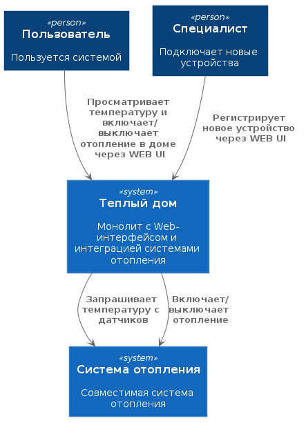
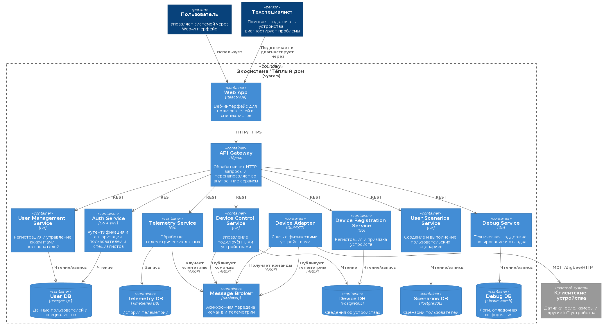
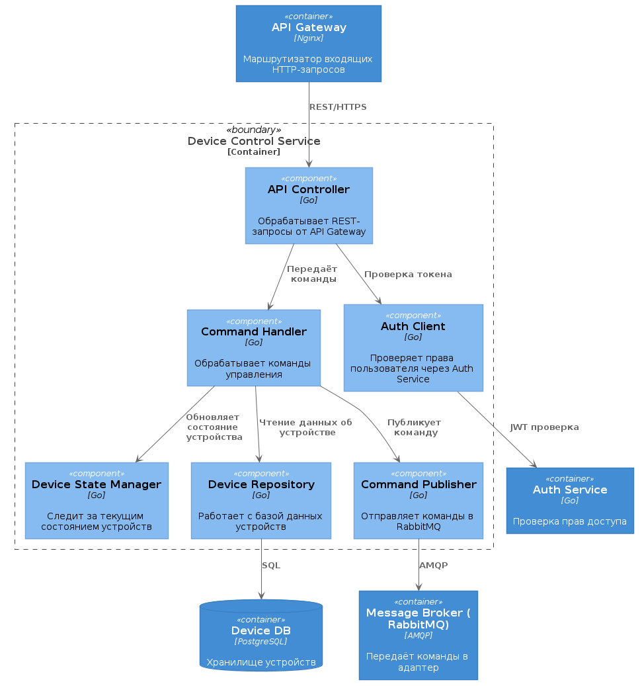
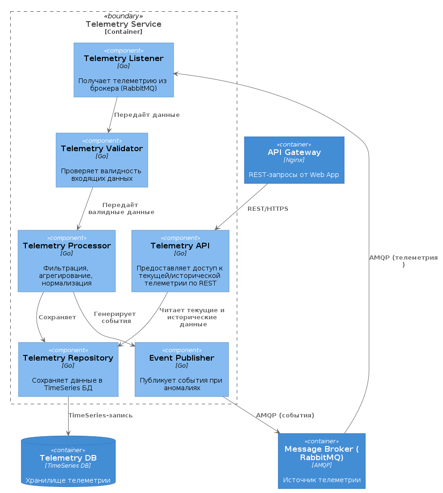
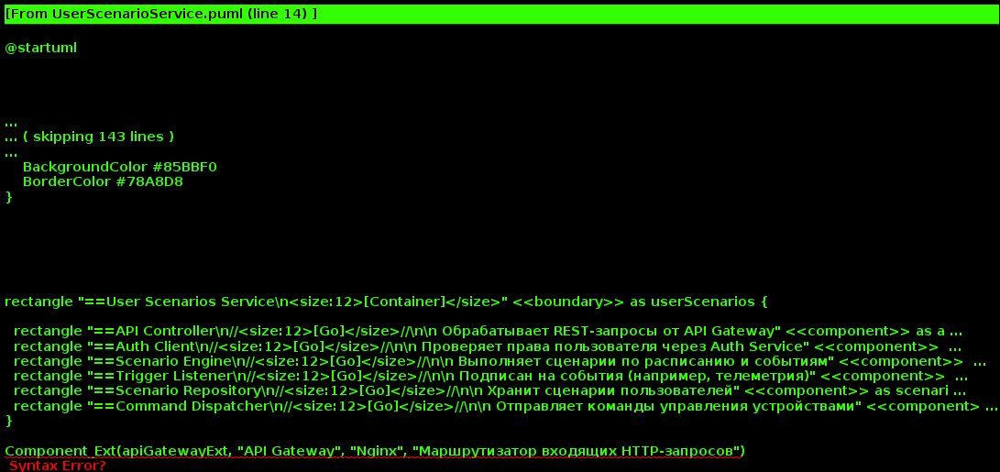
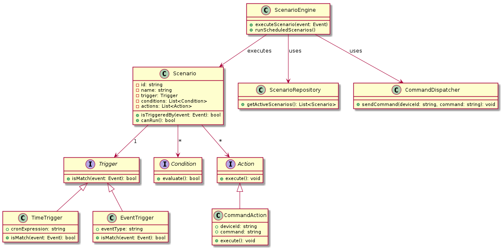
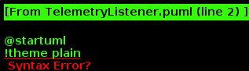
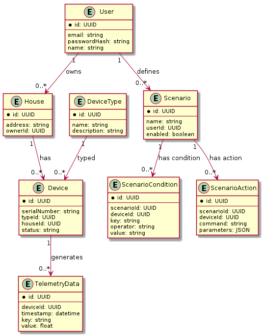

# Задание 1. Анализ и планирование

### 1. Описание функциональности монолитного приложения

**Управление отоплением:**

- Пользователи могут включать и выключать отопление в доме через веб-интерфейс.
- Управление происходит синхронно: команда от пользователя передаётся на сервер, откуда напрямую отправляется управляющий сигнал к устройству в доме.
- Устройства не подключаются автоматически. Подключение системы отопления к приложению возможно только при участии специалиста компании, который выезжает на место и вручную настраивает оборудование.
- Пользователь не может самостоятельно зарегистрировать или заменить устройство в системе.

**Мониторинг температуры:**

- Приложение позволяет пользователям просматривать текущую температуру в доме через веб-интерфейс.
- Температурные данные запрашиваются сервером напрямую у подключённого устройства по синхронной схеме: по запросу — ответ.
- Нет механизма автоматической доставки телеметрии от устройств. Все данные поступают только при активном запросе со стороны сервера.
- История показаний не сохраняется; система отображает только актуальное состояние на момент запроса.

### 2. Анализ архитектуры монолитного приложения

- Язык программирования: Go
- База данных: PostgreSQL
- Архитектура: Монолитная, все компоненты системы (обработка запросов, бизнес-логика, работа с данными) находятся в рамках одного приложения.
- Взаимодействие: Синхронное, запросы обрабатываются последовательно.
- Масштабируемость: Ограничена, так как монолит сложно масштабировать по частям.
- Развертывание: Требует остановки всего приложения.

### 3. Определение доменов и границы контекстов

- Домен: Домашняя автоматизация
  - Контекст: Регистрация устройств
  - Контекст: Управление устройствами
  - Контекст: Мониторинг и телеметрия
  - Контекст: Пользовательские сценарии
- Домен: Техническая поддержка
  - Контекст: Журналирование и отладка
- Домен: Идентификация и доступ
  - Контекст: Управление пользователями
  - Контекст: Роли и авторизация

### **4. Проблемы монолитного решения**

- Сложность изменений. Любые доработки требуют сборки и развёртывания всего приложения, что увеличивает риски и время доставки.
- Сильная связанность. Компоненты не изолированы — изменение одного модуля может повлиять на другие.
- Плохая масштабируемость. Невозможно масштабировать части системы независимо — приходится масштабировать весь монолит.
- Отсутствие гибкости. Сложно внедрять новые функции (например, работу с другими типами устройств) без переписывания существующего кода.
- Ограничения в отказоустойчивости. Сбой в одном компоненте может привести к отказу всей системы.
- Невозможность параллельной разработки. Разработчики ограничены в одновременной работе над разными частями системы из-за общей кодовой базы.
- Нет возможности выбирать технологии. Вся система привязана к одному стеку (Go + Postgres) без возможности использовать более подходящие решения локально в модулях.

### 5. Визуализация контекста системы — диаграмма С4



# Задание 2. Проектирование микросервисной архитектуры

В этом задании вам нужно предоставить только диаграммы в модели C4. Мы не просим вас отдельно описывать получившиеся микросервисы и то, как вы определили взаимодействия между компонентами To-Be системы. Если вы правильно подготовите диаграммы C4, они и так это покажут.

**Диаграмма контейнеров (Containers)**



**Диаграмма компонентов (Components)**





**Диаграмма кода (Code)**




# Задание 3. Разработка ER-диаграммы



# Задание 4. Создание и документирование API

### 1. Тип API

Для взаимодействия между микросервисами в целевой архитектуре будут использоваться два типа API.

REST API

Используется для операций, где требуется мгновенный ответ и жёсткая согласованность, например:
•	Запрос информации о пользователе, устройстве или сценарии.
•	Управление состоянием устройства (включить/выключить).
•	Создание и редактирование пользовательских сценариев.

AsyncAPI

Используется для событийного обмена, где важно масштабирование и независимость компонентов, например:
•	Передача телеметрии от устройств.
•	Уведомления о срабатывании сценариев.
•	Реакция на изменение статуса устройств.

### 2. Документация API

[REST API](docs/api/openapi.yaml)
[Async API](docs/api/asyncapi.yaml)

# Задание 5. Работа с docker и docker-compose

Перейдите в apps.

Там находится приложение-монолит для работы с датчиками температуры. В README.md описано как запустить решение.

Вам нужно:

1) сделать простое приложение temperature-api на любом удобном для вас языке программирования, которое при запросе /temperature?location= будет отдавать рандомное значение температуры.

Locations - название комнаты, sensorId - идентификатор названия комнаты

```
	// If no location is provided, use a default based on sensor ID
	if location == "" {
		switch sensorID {
		case "1":
			location = "Living Room"
		case "2":
			location = "Bedroom"
		case "3":
			location = "Kitchen"
		default:
			location = "Unknown"
		}
	}

	// If no sensor ID is provided, generate one based on location
	if sensorID == "" {
		switch location {
		case "Living Room":
			sensorID = "1"
		case "Bedroom":
			sensorID = "2"
		case "Kitchen":
			sensorID = "3"
		default:
			sensorID = "0"
		}
	}
```

2) Приложение следует упаковать в Docker и добавить в docker-compose. Порт по умолчанию должен быть 8081

3) Кроме того для smart_home приложения требуется база данных - добавьте в docker-compose файл настройки для запуска postgres с указанием скрипта инициализации ./smart_home/init.sql

Для проверки можно использовать Postman коллекцию smarthome-api.postman_collection.json и вызвать:

- Create Sensor
- Get All Sensors

Должно при каждом вызове отображаться разное значение температуры

Ревьюер будет проверять точно так же.


