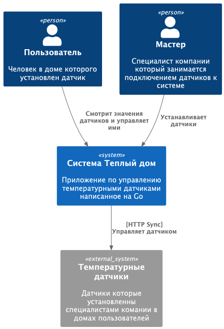
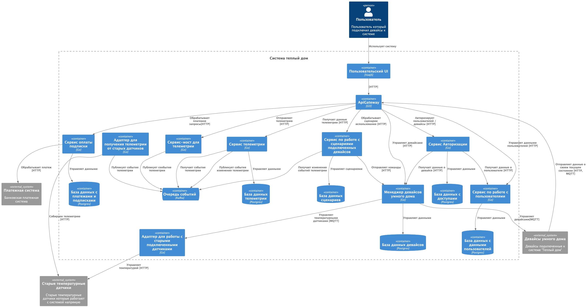
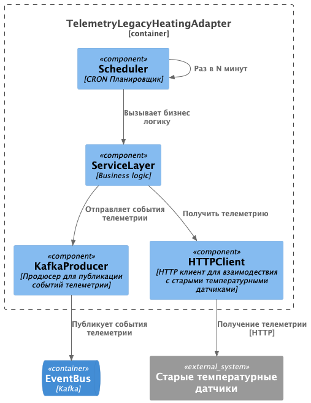
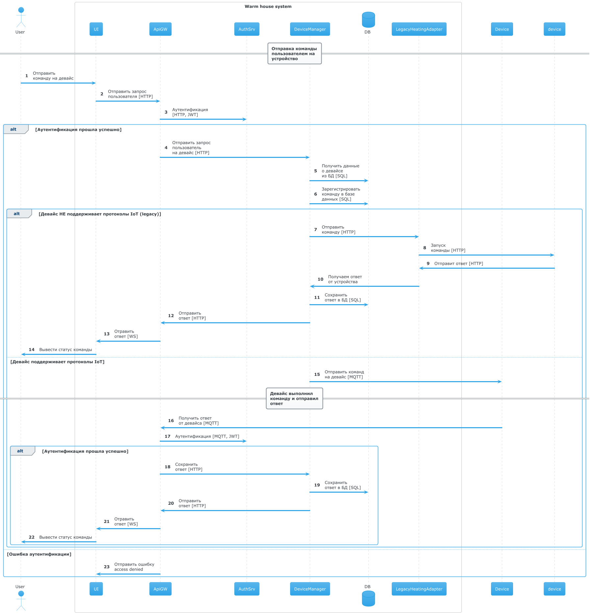
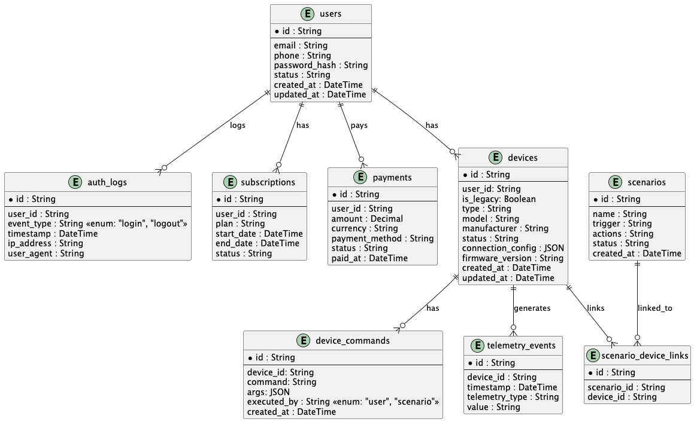

# Project_template

Это шаблон для решения проектной работы. Структура этого файла повторяет структуру заданий. Заполняйте его по мере работы над решением.

# Задание 1. Анализ и планирование

<aside>

Чтобы составить документ с описанием текущей архитектуры приложения, можно часть информации взять из описания компании и условия задания. Это нормально.

</aside>

### 1. Описание функциональности монолитного приложения

**Управление отоплением:**

- Пользователи могут: устанавливать нужную температуру
- Система поддерживает: Администрирование (добавление, удаление, просмотр) установленного сенсора через веб интерфейс
- Ограничения: Любые взаимодействия сенсорами возможны только после их установки в доме специалистом компании

**Мониторинг температуры:**

- Пользователи могут: просматривать данные о температуры для конкретного сенсора или определенной локации
- Система: получает данные о температуре для конкретного сервиса / локации путем отправки синхронного запроса 
на конеретный датчик

### 2. Анализ архитектуры монолитного приложения

Приложение из себя представляет монолитный rest-api сервис написанный на GO, использующий Postgres в качестве CУБД.
Все endpoint-ы приложения синхронные. Взаимодействие с температурными датчиками осуществляется путем отправки 
синхронного http запроса от сервера к определенному датчику.

### 3. Определение доменов и границы контекстов
Домены:
1. Менеджмент девайсов:
   - подключение новых девайсов
   - управление подключенными девайсами
   - настройка сценариев по управлению

2. Кабинет пользователя
   - Регистрация новых пользователей.
   - Привязка новых устройств к определенному пользовательскому аккаунту

### **4. Проблемы монолитного решения**

- Сложно добавить новый тип девайса по мимо температурных датчиков, придется писать новый код который будет 
взаимодествовать с другими девайсами
- Так как приложение монолитное любое добавление нового домена или изменение существующего будет влиять на 
все другие домены
- Отказоустойчивость, при падении какой то домена в монолите, все система будет страдать.
- Дорогое масштабирование, при необходимости масштабировать ресурсы для какого то домена 
нужно будет масштабировать все приложение целиком.


### 5. Визуализация контекста системы — диаграмма С4



# Задание 2. Проектирование микросервисной архитектуры

В этом задании вам нужно предоставить только диаграммы в модели C4. Мы не просим вас отдельно описывать получившиеся микросервисы и то, как вы определили взаимодействия между компонентами To-Be системы. Если вы правильно подготовите диаграммы C4, они и так это покажут.

**Диаграмма контейнеров (Containers)**



**Диаграмма компонентов (Components)**

ApiGateway


AuthService


BillingService


DeviceManager


ScenarioService


LegacyHeatingAdapter


TelemetryBridgeService


TelemetryLegacyHeatingAdapter



TelemetryService


**Диаграмма кода (Code)**

Отправка команд на девайсы



Сбор телеметрии из устаревших температурных датчиков


Сбор телеметрии для IoT девайсов


Запуск пользовательских сценариев


# Задание 3. Разработка ER-диаграммы



# Задание 4. Создание и документирование API

### 1. Тип API

1. Для взаимосдействия между микросервисами я выбрал RestAPI ввиду того что все операции взаимодествия междуу сервисами 
достатоно простые сценарии, и тут накладные расходы более продвинутых протоколов таких как GRPC не оправданны

2. Для Взаимодействия между девайсами и нашим сервисом я выбрал AsyncAPI с протоколом MQTT так как это является
стандартом для взаимодействия с умными устройствами

### 2. Документация API

OpenAPI

[openapi.yml](docs/api/openapi.yml)

Async API

[asyncapi.yml](docs/api/asyncapi.yml)

# Задание 5. Работа с docker и docker-compose

Перейдите в apps.

Там находится приложение-монолит для работы с датчиками температуры. В README.md описано как запустить решение.

Вам нужно:

1) сделать простое приложение temperature-api на любом удобном для вас языке программирования, которое при запросе /temperature?location= будет отдавать рандомное значение температуры.

Locations - название комнаты, sensorId - идентификатор названия комнаты

```
	// If no location is provided, use a default based on sensor ID
	if location == "" {
		switch sensorID {
		case "1":
			location = "Living Room"
		case "2":
			location = "Bedroom"
		case "3":
			location = "Kitchen"
		default:
			location = "Unknown"
		}
	}

	// If no sensor ID is provided, generate one based on location
	if sensorID == "" {
		switch location {
		case "Living Room":
			sensorID = "1"
		case "Bedroom":
			sensorID = "2"
		case "Kitchen":
			sensorID = "3"
		default:
			sensorID = "0"
		}
	}
```

2) Приложение следует упаковать в Docker и добавить в docker-compose. Порт по умолчанию должен быть 8081

3) Кроме того для smart_home приложения требуется база данных - добавьте в docker-compose файл настройки для запуска postgres с указанием скрипта инициализации ./smart_home/init.sql

Для проверки можно использовать Postman коллекцию smarthome-api.postman_collection.json и вызвать:

- Create Sensor
- Get All Sensors

Должно при каждом вызове отображаться разное значение температуры

Ревьюер будет проверять точно так же.


