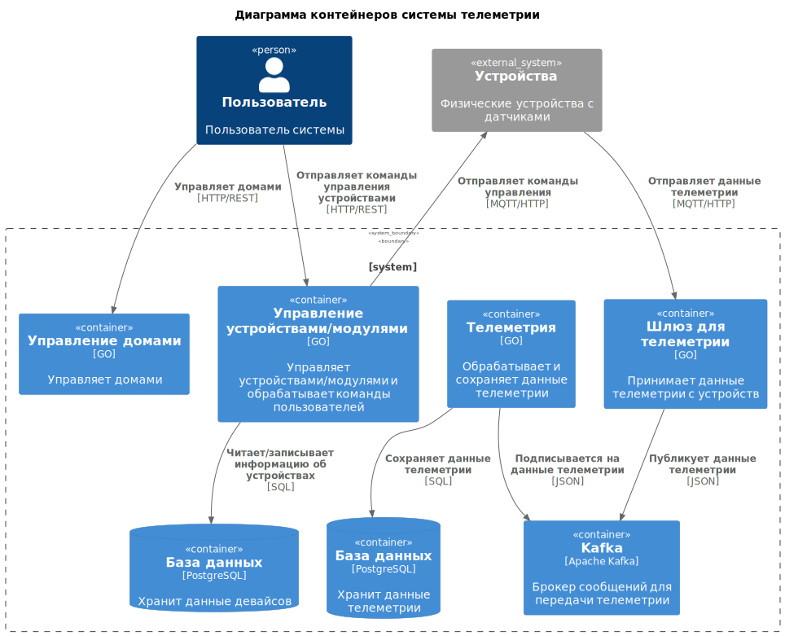
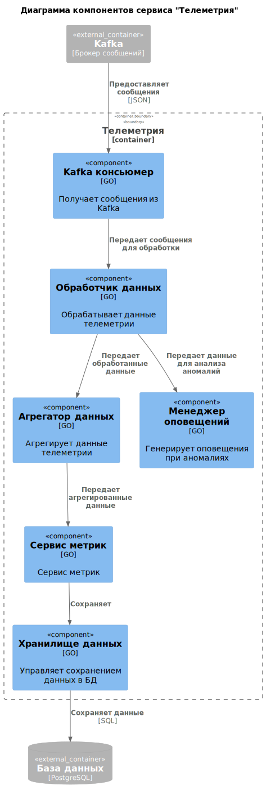
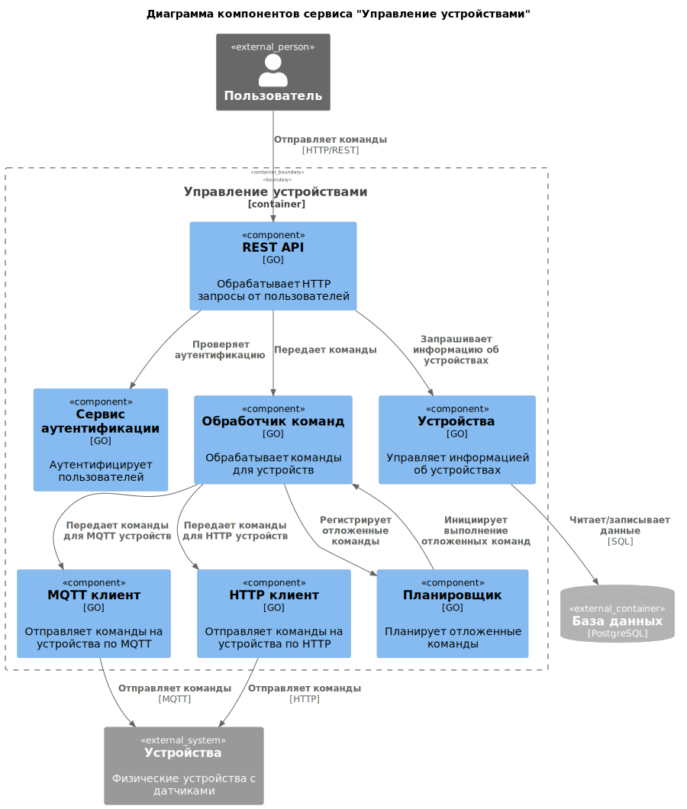
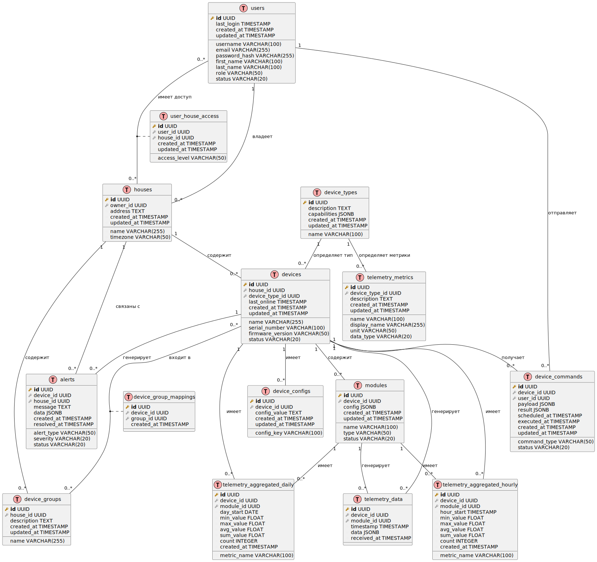

# Project_template

Это шаблон для решения проектной работы. Структура этого файла повторяет структуру заданий. Заполняйте его по мере работы над решением.

# Задание 1. Анализ и планирование

<aside>

Чтобы составить документ с описанием текущей архитектуры приложения, можно часть информации взять из описания компании и условия задания. Это нормально.

</aside

### 1. Описание функциональности монолитного приложения

**Управление отоплением:**

- Пользователи могут управлять отоплением в своем доме
- Система позволяет управлять сенсорами: получить все сенсоры, получить сенсор по id, создать сенсор, обновить сенсор, удалить сенсор

**Мониторинг температуры:**

- Пользователи могут проверять температуру в своем доме
- Система позволяет установить значения у сенсора

### 2. Анализ архитектуры монолитного приложения

- Язык программирования: Go
- База данных: PostgreSQL
- Архитектура: Монолитная, все компоненты системы (обработка запросов, бизнес-логика, работа с данными) находятся в рамках одного приложения.
- Взаимодействие: Синхронное, запросы обрабатываются последовательно.
- Масштабируемость: Ограничена, так как монолит сложно масштабировать по частям.
- Развертывание: Требует остановки всего приложения.

### 3. Определение доменов и границы контекстов

домен "Управление Устройствами", Домен "Мониторинг температуры"

### **4. Проблемы монолитного решения**

- Масштабируемость ограничена.
- Релизы - приходится останавливать целиком приложение.
- Есть риск, что при изменении в одном месте(управление устройствами), может сломаться другой(мониторинг температуры).

Но в целом, наверное, с доработками монолита можно было бы реализовать новое решение.

### 5. Визуализация контекста системы — диаграмма С4

# Задание 2. Проектирование микросервисной архитектуры

**Диаграмма контейнеров (Containers)**

**Диаграмма компонентов (Components)**

# Задание 3. Разработка ER-диаграммы

Добавьте сюда ER-диаграмму. Она должна отражать ключевые сущности системы, их атрибуты и тип связей между ними.

# Задание 4. Создание и документирование API

### 1. Тип API

Будет использоваться REST API и асинхронное взаимодействие через Kafka и девайсы смогут через MQTT отправлять данные асинхронно.

### 2. Документация API

[Swagger](./docs/swagger.json)
[AsycAPI](./docs/async.json)

# Задание 5. Работа с docker и docker-compose

Готово

